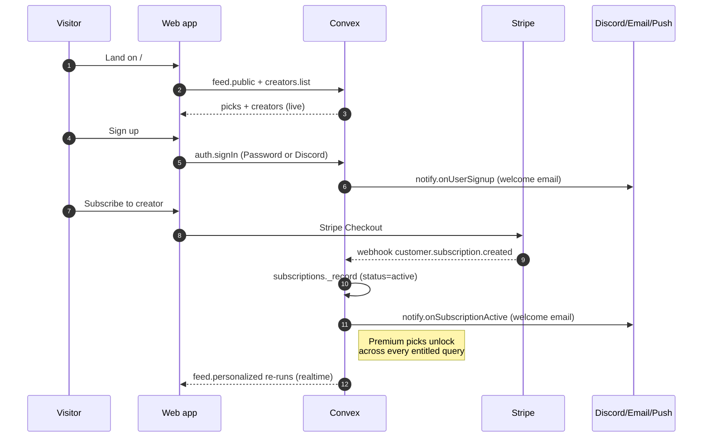
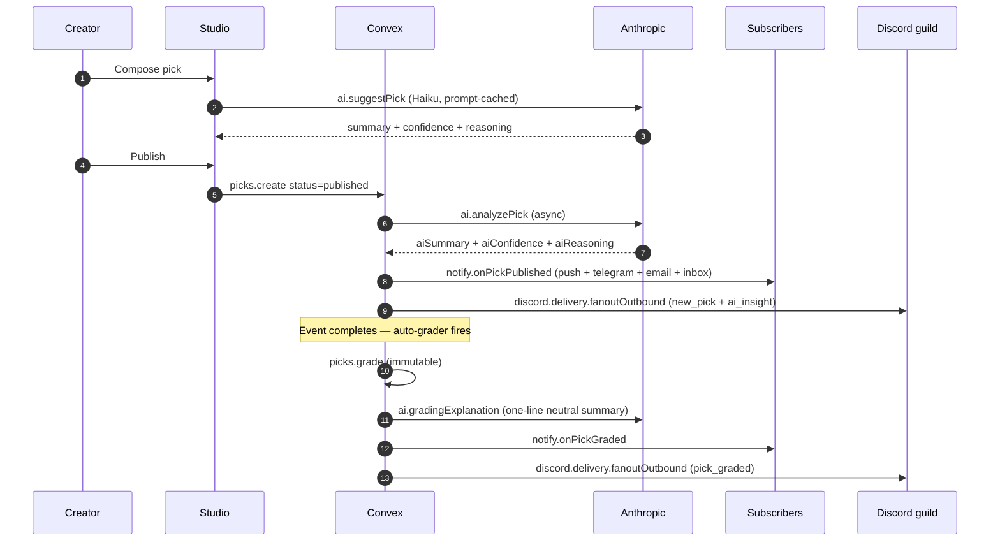
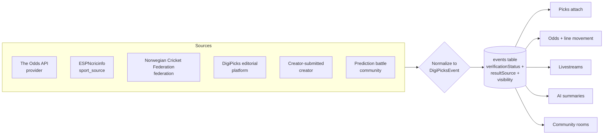
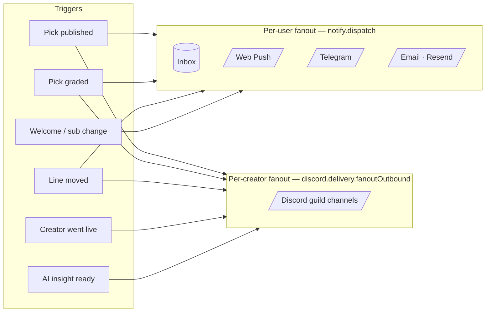
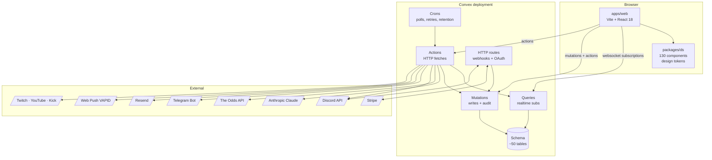

<div align="center">

```
██████╗ ██╗ ██████╗ ██╗██████╗ ██╗ ██████╗██╗  ██╗███████╗
██╔══██╗██║██╔════╝ ██║██╔══██╗██║██╔════╝██║ ██╔╝██╔════╝
██║  ██║██║██║  ███╗██║██████╔╝██║██║     █████╔╝ ███████╗
██║  ██║██║██║   ██║██║██╔═══╝ ██║██║     ██╔═██╗ ╚════██║
██████╔╝██║╚██████╔╝██║██║     ██║╚██████╗██║  ██╗███████║
╚═════╝ ╚═╝ ╚═════╝ ╚═╝╚═╝     ╚═╝ ╚═════╝╚═╝  ╚═╝╚══════╝
```

**Realtime sports intelligence + creator economy platform**

_Verified creators publish picks · customers subscribe for premium access ·
AI summarizes the analysis · alerts fan out across email, push,
Telegram, and Discord — in realtime._

[](https://convex.dev)
[](https://react.dev)
[](https://www.typescriptlang.org)
[](https://vite.dev)
[](https://www.anthropic.com)
[](#testing)
[](#license)

</div>

---

> **"The Bloomberg Terminal + TradingView for Sports Intelligence."**
> — `docs/PRD.md`

DigiPicks is **not** a sportsbook. It positions as **sports analytics**:
transparent grading, creator monetization, AI-augmented discovery, and
realtime market awareness. Every claim is auditable. Every grade is
immutable. Every notification has a trail.

---

## Why DigiPicks is different

```
┌──────────────────────────────────────────────────────────────────────┐
│  Most picks platforms     →    DigiPicks                             │
├──────────────────────────────────────────────────────────────────────┤
│  Locked to one provider   →    Federated Event Engine — any sport,   │
│                                any league, any competition           │
│  Creator promises         →    Trust scores from real outcomes,      │
│                                recomputed nightly                    │
│  Static grades            →    Immutable + dispute-driven override   │
│                                with paired audit trail               │
│  Email-only delivery      →    Push, Telegram, Discord (per-creator  │
│                                guild fanout), email, in-app inbox    │
│  AI as a marketing line   →    Tool-using Sonnet 4.6 Copilot with    │
│                                mandatory citations + sample sizes    │
│  Page-level styling       →    130-component DS, design-token        │
│                                contract enforced in CI               │
└──────────────────────────────────────────────────────────────────────┘
```

---

## Who it's for

<table>
<tr>
<td valign="top" width="33%">

### Subscribers

Discover verified creators, subscribe to the ones you trust, get a
realtime feed with line-movement alerts, save picks, ask the AI Copilot
"who's the best NFL creator with 65%+ win rate this month?" and get a
real cited answer.

**Surfaces:** `/`, `/account/*`, Discord notifications, Telegram alerts.

</td>
<td valign="top" width="33%">

### Creators

Apply, get verified, publish picks (with AI co-write, scheduled
publishing, premium tier gating), see your performance broken down by
sport / market / window, monetize via Stripe-backed subscriptions,
livestream with a stream-linked community room, push your audience to
your Discord guild automatically.

**Surfaces:** `/dashboard/*` (the creator studio).

</td>
<td valign="top" width="33%">

### Admins

Review applications + custom events, moderate disputes (with paired
grade-override audit when needed), audit every sensitive action,
respond to GDPR requests, watch realtime fraud signals + trust score
drift.

**Surfaces:** `/admin/*`, MFA-gated mutations, append-only `auditLogs`.

</td>
</tr>
</table>

---

## What it does

### Customer journey



### Creator publish → grade → fanout



### Federated event engine



> The Federated Event Engine is the **strategic differentiator** —
> covers EPL final, Norwegian cricket, FIFA tournaments, and creator
> challenges through a single canonical event model. See
> [`docs/SRSD.md §5`](./docs/SRSD.md) for the type contract.

---

## Feature surface

### Realtime + creator economy

|                                  |                                                                                                                                                                                                                                                 |
| -------------------------------- | ----------------------------------------------------------------------------------------------------------------------------------------------------------------------------------------------------------------------------------------------- |
| **Subscriptions + grace period** | Stripe-backed tiers per creator (`free` / `premium` / `vip`). `past_due` keeps access for `GRACE_PERIOD_DAYS` so a transient payment hiccup doesn't yank entitlement. Lifecycle dispatches (welcome / past_due / cancelled) over email + inbox. |
| **Performance + grading**        | Pending → win / loss / push, immutable once finalized (NFR-006). Net units, win rate, ROI, last-10, streak — recomputed reactively. AI generates a one-line neutral grading explanation.                                                        |
| **Trust score**                  | 0–100 composite (verification 30% · win rate 25% · dispute ratio 20% · age 15% · sample size 10%) recomputed nightly. Surfaced as a badge wherever a creator appears.                                                                           |
| **Custom events**                | Creators submit local cricket / FIFA tournament / private match events. Admin reviews, MFA-gated, audit-logged. Picks attach.                                                                                                                   |
| **Watchlists + line movement**   | User-defined filters (sport / league / creator / market / confidence / line-move %). Hourly poller dispatches push + telegram + Discord on threshold cross.                                                                                     |

### AI surfaces

|                            |                                                                                                                                                                                                                                                                                             |
| -------------------------- | ------------------------------------------------------------------------------------------------------------------------------------------------------------------------------------------------------------------------------------------------------------------------------------------- |
| **Per-pick analysis**      | Anthropic Haiku 4.5 with prompt-cached system block. Fills `aiSummary` / `aiConfidence` / `aiReasoning` async after publish.                                                                                                                                                                |
| **Co-write**               | Pre-publish suggestion the creator can accept or override — same cache entry as analysis to keep token costs low.                                                                                                                                                                           |
| **Grading explanation**    | Post-grade neutral one-liner ("Took -3.5; final 27-21 covered by 2.5") for the customer-facing timeline.                                                                                                                                                                                    |
| **Authenticity scoring**   | Advisory 0–100 score on every new application, surfaced to admins in the review queue. Never auto-rejects.                                                                                                                                                                                  |
| **Conversational Copilot** | Sonnet 4.6 with a tool-use loop. 4 tools (`lookupCreator`, `creatorPerformance`, `eventDetails`, `creatorTrust`). Convex-native streaming via incremental row patches — no SSE plumbing. Mandatory citations with sample-size context. PII scrubbing on input. Dedicated rate-limit bucket. |
| **AI-ranked feed**         | Optional `rankByAi: true` arg on `feed.personalized`. Pure-function blend: 0.40 AI confidence · 0.25 trust · 0.20 recency-decay · 0.15 confidence enum.                                                                                                                                     |

### Notifications + integrations



- **Per-user** — push, telegram, email, in-app inbox, keyed on
  recipient. Quiet hours defer push + telegram (in-app + email always
  fire). Lifecycle kinds bypass quiet hours.
- **Per-creator** — Discord embeds posted to the creator's mapped guild
  channels, keyed on creator (one creator → many viewers). Six event
  types with per-channel `alertRules` + `minConfidence`. Failed
  deliveries retry every 10 min via the cron.
- **Idempotent** — Stripe webhook replays short-circuit via
  `stripeEvents`. Inbox dedup on `entityKey` within
  `NOTIFY_DEDUP_WINDOW_MS`. Discord delivery logs dedup on
  `discordMessageId`.

### Trust + compliance

- **MFA (TOTP)** with freshness gates on every sensitive admin action.
- **Audit logs** — append-only, every admin action, every override.
- **GDPR** — full data export + scrub-cascade delete (rate-limited).
- **PII scrubbing** — Copilot user messages have emails + PAN-like
  digit runs redacted before storage; sha-256 hash kept for audit
  reidentification.
- **Email verification** — token-hash flow, 24h TTL, never stores
  plaintext.

---

## Architecture



**Convex is the source of truth.** No Kafka. No Redis. No bespoke
WebSocket layer. Convex queries auto-update on every transitive write,
which is what makes the platform feel alive.

---

## Stack

| Layer             | Tech                                                                                                                 |
| ----------------- | -------------------------------------------------------------------------------------------------------------------- |
| Frontend          | React 18 · Vite · TypeScript · React Router · Convex React · Framer Motion                                           |
| Component library | `@digipicks/ds` — 130+ components across atoms / forms / surfaces / data / nav / layout / feedback / motion / domain |
| Tokens            | `@digipicks/tokens` — CSS variables for color, spacing, motion, type, elevation                                      |
| Backend           | [Convex](https://convex.dev) — realtime DB + queries + mutations + actions + cron + HTTP                             |
| Auth              | Convex Auth (Password + Discord OAuth) · MFA via TOTP (RFC 6238) · MFA freshness gates                               |
| Payments          | Stripe Checkout + webhooks · idempotent via `stripeEvents` · per-creator pricing tiers · grace period                |
| AI                | Anthropic Claude — Haiku 4.5 (single-shot) · Sonnet 4.6 (Copilot tool-use loop, streaming)                           |
| Email             | Resend (transactional + verification)                                                                                |
| Notifications     | Web Push (VAPID) · Telegram Bot · Discord (per-creator) · Email · In-app inbox                                       |
| External data     | The Odds API · ESPNcricinfo · Twitch · YouTube · Kick                                                                |
| Tests             | Vitest + `convex-test`                                                                                               |

---

## Repository layout

```
DigiPicks/
├── apps/
│   └── web/                    # Vite + React app — single SPA, /public + /account + /dashboard
├── packages/
│   ├── ds/                     # Component library (atoms, forms, surfaces, data, nav,
│   │                           #   layout, feedback, motion, domain — design-token driven)
│   ├── tokens/                 # Design tokens (CSS variables: colors, spacing, motion, …)
│   ├── shared/                 # Cross-package types + helpers
│   ├── app-shell/              # Theme provider, route shells, error boundaries
│   ├── sdk/                    # Convex hooks wrappers
│   ├── eslint-config/          # Shared ESLint preset
│   └── tsconfig/               # Shared TS config preset
├── convex/                     # Backend — 60+ modules
│   ├── schema.ts               # Single source of truth for the data model
│   ├── crons.ts                # Cron registrations
│   ├── http.ts                 # HTTP endpoints (Stripe webhook, Discord OAuth + interactions, …)
│   ├── shared/                 # Permission helpers, retry, sentry, rate limiter, sport keys, fees
│   ├── aiCopilot/              # M24 multi-turn Copilot (queries · mutations · respond · tools · scrub)
│   └── discord/                # M20 inbound + outbound (delivery · sentiment · oauth · gdpr · threads)
└── docs/
    ├── PRD.md                  # Product requirements
    ├── SRSD.md                 # Software requirements specification
    ├── RUNBOOK.md              # Day-2 operations
    ├── modules/M01–M25         # Engineering specs per module (25 files)
    ├── bpmn/BPMN-001–016       # Workflow diagrams (Mermaid; one per core flow)
    └── functionality-index.md  # Original feature backlog
```

---

## Quickstart

### Prerequisites

- Node ≥ 20
- `pnpm` ≥ 9
- A Convex account (or `npx convex dev` to provision a personal dev deployment)

### Install + run

```bash
pnpm install
pnpm dev              # spawns convex dev + web dev concurrently
```

Web dev server lands at `http://localhost:5173`. Convex dashboard URL
is printed by `convex dev`.

### Useful scripts

```bash
pnpm dev              # convex dev + web dev (concurrently)
pnpm dev:web          # web dev only
pnpm dev:convex       # convex dev only
pnpm typecheck        # repo-wide tsc --noEmit (8 packages)
pnpm test             # vitest run (Convex backend tests)
pnpm lint             # eslint where configured
pnpm build            # production build (web + DS package)
```

---

## Environment variables

Set Convex env vars with `npx convex env set <KEY> <value>`. Vite vars
go in `.env.local` at the repo root.

### Required for full feature parity

| Var                                                         | Purpose                                           | Module    |
| ----------------------------------------------------------- | ------------------------------------------------- | --------- |
| `STRIPE_SECRET_KEY`                                         | Stripe API access                                 | M07       |
| `STRIPE_WEBHOOK_SECRET`                                     | HMAC verify on `/stripe-webhook`                  | M07       |
| `ANTHROPIC_API_KEY`                                         | Claude API for AI summaries + Copilot             | M12 · M24 |
| `THE_ODDS_API_KEY`                                          | Live odds + upcoming events polling               | M11 · M22 |
| `RESEND_API_KEY`                                            | Email delivery (welcome, verification, lifecycle) | M13 · M01 |
| `RESEND_FROM_EMAIL`                                         | Default `From:` (`"DigiPicks <hello@…>"`)         | M13       |
| `WEB_PUSH_VAPID_PUBLIC_KEY` / `…_PRIVATE_KEY` / `…_SUBJECT` | Web push (VAPID)                                  | M13       |
| `TELEGRAM_BOT_TOKEN`                                        | Telegram notifications                            | M21       |
| `AUTH_DISCORD_ID` / `AUTH_DISCORD_SECRET`                   | Discord OAuth signin                              | M01       |
| `DISCORD_BOT_TOKEN`                                         | M20 inbound Discord ingest                        | M20       |
| `DISCORD_OAUTH_ENC_KEY`                                     | AES-256-GCM key for Discord OAuth tokens          | M20       |
| `DISCORD_PUBLIC_KEY`                                        | Ed25519 verify on `/discord/interactions`         | M20       |
| `DISCORD_AUTHOR_SALT`                                       | sha-256 author hashing for inbound msgs (privacy) | M20       |
| `WEB_BASE_URL`                                              | Used for deep links in emails / notifications     | M13       |
| `SENTRY_DSN_NODE`                                           | Server-side Sentry (Node actions only)            | M02       |

### Operational tunables (all optional)

| Var                            | Default        | Effect                                                   |
| ------------------------------ | -------------- | -------------------------------------------------------- |
| `GRACE_PERIOD_DAYS`            | 3              | Past-due subscription grace window before access revokes |
| `PLATFORM_FEE_RATE_BPS`        | 1300 (13%)     | Platform + processing fee shown on Earnings page         |
| `NOTIFY_DEDUP_WINDOW_MS`       | 300000 (5 min) | Inbox dedup window per `entityKey`                       |
| `LINE_MOVE_THRESHOLD_PCT`      | 5              | Implied-probability threshold for line-movement alerts   |
| `ODDS_SNAPSHOTS_ENABLED`       | false          | Daily bookmaker odds capture (quota-heavy, opt-in)       |
| `SPORT_SOURCE_CRICKET_ENABLED` | false          | ESPNcricinfo scraper enable flag                         |
| `SEED_TOKEN`                   | —              | Bearer token for `/seed-events` admin trigger            |
| `RESEND_VERIFY_FROM`           | —              | Override `From:` for verification emails                 |

> Anything missing from this list is a **quiet no-op** — the relevant
> feature degrades gracefully (e.g., AI returns `{ skipped: true }`,
> notifications drop the channel) so dev environments don't blow up.

---

## Architectural contract

Every contributor reads [`CLAUDE.md`](./CLAUDE.md) — it's a hard
contract for how UI is built:

```
Apps compose DS components only.
NO inline styles. NO raw classNames on DOM. NO Tailwind utilities.
NO .css files in apps/**.
All values in CSS modules use var(--token-name).
Every page is thin — composition, no business logic.
```

Four strict-mode greps in `CLAUDE.md §7` must return zero hits in
`apps/**` for any commit to be considered clean. CI mirrors these
checks. The repo is currently clean: `pnpm typecheck` across 8
packages, 86/86 tests passing, 0 strict-mode violations.

---

## Module + workflow index

```
docs/modules/                docs/bpmn/
─────────────                ─────────
M01  Auth + identity         BPMN-001  Visitor registration
M02  Realtime foundation     BPMN-002  Visitor → subscriber
M03  Component library       BPMN-003  Subscription lifecycle
M04  Federated events        BPMN-004  Customer feed
M05  Picks publishing        BPMN-005  Watchlists + tracking
M06  Access + entitlements   BPMN-006  Creator verification
M07  Subscription billing    BPMN-007  Pick publishing
M08  Creator verification    BPMN-008  Livestream
M09  Grading + performance   BPMN-009  Custom event
M10  Customer feed           BPMN-010  Moderation
M11  Realtime odds           BPMN-011  Disputes
M12  AI Intelligence         BPMN-012  Odds sync
M13  Notifications           BPMN-013  Pick grading
M14  Community               BPMN-014  AI Intelligence pipeline
M15  Livestream              BPMN-015  Notification orchestration
M16  Creator analytics       BPMN-016  Event lifecycle
M17  Admin operations
M18  Saved library
M19  Referrals + growth
M20  Discord integration
M21  Telegram integration
M22  External providers
M23  Custom event federation
M24  AI Copilot
M25  Compliance + audit
```

Both sets of docs are **executable architecture documentation** — when
code changes, the docs change in the same commit. Drift is regularly
audited.

---

## Testing

```bash
pnpm test
```

86 tests across 9 files cover: auth + MFA · channel access gating ·
disputes lifecycle · federated event ingest · feed personalization ·
saved-picks idempotency · Stripe subscription mapping · AI parse safety
· Copilot PII scrubbing.

E2E coverage (Playwright) is deferred — see
[`docs/modules/M25-platform-settings-compliance-audit.md`](./docs/modules/M25-platform-settings-compliance-audit.md).

---

## Operations

See [`docs/RUNBOOK.md`](./docs/RUNBOOK.md) for incident response,
backfill procedures, and recovery playbooks.

For Convex dashboard tasks: cron audit, manual `events.seedFromOddsApi`
trigger, idempotent migration mutations (`migrations.*`), and the
`/admin` web surface for moderation queues + audit feed.

---

## License

Proprietary — © Xala Technologies. Not for redistribution.
