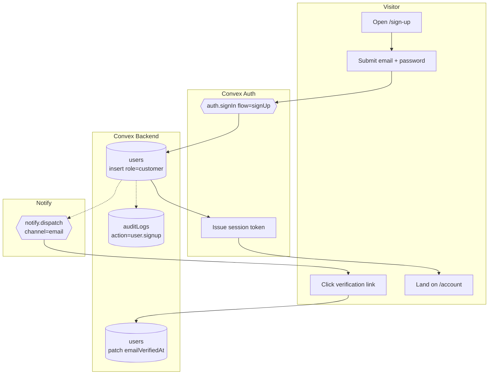

# BPMN-001 — Visitor registration flow

## Purpose

A visitor signs up, verifies their email, and lands as an authenticated
`customer` with a session.

## Trigger

Visitor submits the sign-up form on `/sign-up`.

## Preconditions

- Visitor is unauthenticated.
- Email is not already bound to an existing `users` row.

## Actors / Swimlanes

- **Visitor** — browser submitting credentials.
- **Convex Auth** — `@convex-dev/auth` provider, password flow.
- **Convex Backend** — `users` + `auditLogs` tables, `users.createOrUpdate`.
- **Notify** — `notify.dispatch` action (email channel).

## Main flow

## Alternative flows

- **Email already in use** → Auth returns `409`, visitor stays on form.
- **Weak password** → Auth provider rejects before any insert.
- **Email never confirmed** → Soft-gate UI surfaces a re-send banner; the
  account still functions but appears unverified in admin.
- **Verification token expired** → user requests a new link; previous
  audit row stays (append-only).

## Postconditions

- One row in `users` with `role='customer'`.
- One audit row `user.signup`.
- Session cookie set; `useQuery(api.users.meSafe)` resolves.

## Realtime events

- `users.meSafe` flips from `null` → user shape.
- Admin `admin.summary` audit feed picks up the new entry.

## AI interactions

None.

## Module mapping

- [M01 — Identity & accounts](../modules/M01-identity-accounts.md)
- [M22 — Audit log](../modules/M22-audit-log.md)
