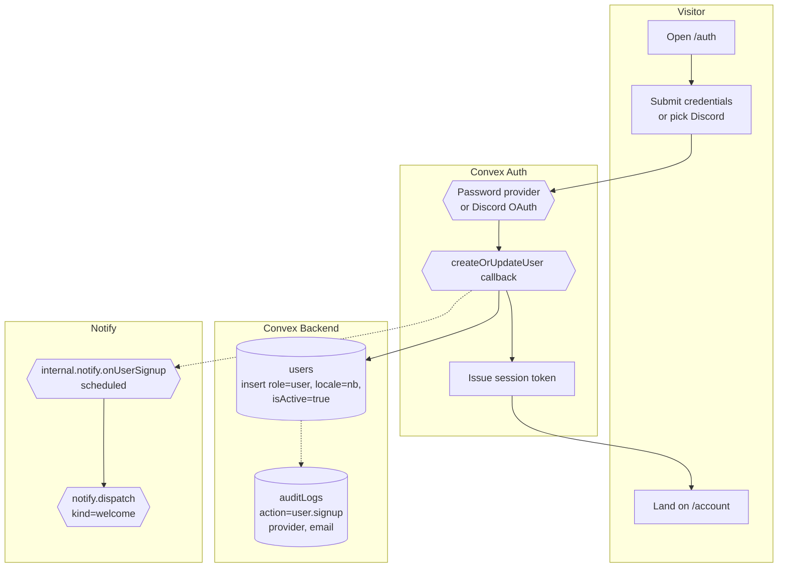

# BPMN-001 — Visitor registration flow

## Purpose

A visitor signs up and lands as an authenticated user with a session.
Email verification is reserved on the schema but **not enforced** today
(see §Alternative flows).

## Trigger

Visitor submits the sign-up form on `/auth` (or completes Discord OAuth).

## Preconditions

- Visitor is unauthenticated.
- Email is not already bound to an existing `users` row.

## Actors / Swimlanes

- **Visitor** — browser submitting credentials or running OAuth.
- **Convex Auth** — `@convex-dev/auth` server (Password + Discord providers).
- **Convex Backend** — `users` + `auditLogs`. The
  `createOrUpdateUser` callback in `convex/auth.ts` inserts the row,
  writes a `user.signup` audit row, and schedules
  `internal.notify.onUserSignup` in the same transaction.
- **Notify** — `internal.notify.onUserSignup` dispatches the
  `welcome` lifecycle kind. Lifecycle kinds bypass per-kind
  `notifyPrefs` toggles (transactional, not opt-in).

## Main flow

## Alternative flows

- **Email already in use** → Auth returns an error, visitor stays on
  the form. No row inserted; no audit row written.
- **Weak password** → Password provider rejects before
  `createOrUpdateUser` fires.
- **Discord existing user** → callback's `existingUserId` branch patches
  `discordId` + `discordUsername` on the existing row. No new audit row
  is written (this is a link, not a signup) and no welcome notify
  fires.
- **Email verification** — Password signups schedule
  `internal.emailVerification._initiate` from the auth callback. The
  action generates a 32-byte token, hashes it (sha-256), stamps
  `emailVerificationTokenHash` + `emailVerificationExpiresAt` on the
  user, and emails the user a `WEB_BASE_URL/auth/verify?token=…` link
  via Resend. The user's click hits `auth.confirm({ token })` which
  validates the hash, checks the 24h expiry, and stamps
  `emailVerificationTime`. Discord OAuth signups skip this — Discord
  vouches for the email. Quiet no-op when `RESEND_API_KEY` is unset
  (signup still succeeds; admins see the unverified state).
- **Verification link expired or wrong** → `auth.confirm` returns
  `{ ok: false, reason: 'expired' | 'invalid-token' }` and the UI
  prompts for a re-send via `auth.requestVerification` (rate-limited
  via the `applicationsSubmit` bucket).
- **Welcome notify fails** → fire-and-forget, swallowed at the dispatch
  layer; signup completes regardless.

## Postconditions

- One row in `users` with `role='user'`, `isActive=true`, default
  `locale='nb'`.
- For Discord OAuth: `discordId` + `discordUsername` populated.
- One `auditLogs` row with `action='user.signup'` carrying
  `provider: 'password' | 'discord'` + `email`.
- One in-app `notifications` row with `kind='welcome'` (lifecycle kind,
  bypasses per-kind toggles).
- Session cookie set; `useQuery(api.users.meSafe)` resolves.

## Realtime events

- `users.meSafe` flips from `null` → user shape on every subscriber.
- `notifications.inbox` shows the welcome row.
- Admin audit feed picks up the `user.signup` row.

## AI interactions

None.

## Module mapping

- [M01 — Authentication, identity & roles](../modules/M01-authentication-identity-roles.md)
- [M13 — Notifications & smart alerts](../modules/M13-notifications-smart-alerts.md)
- [M25 — Platform settings, compliance & audit](../modules/M25-platform-settings-compliance-audit.md)
