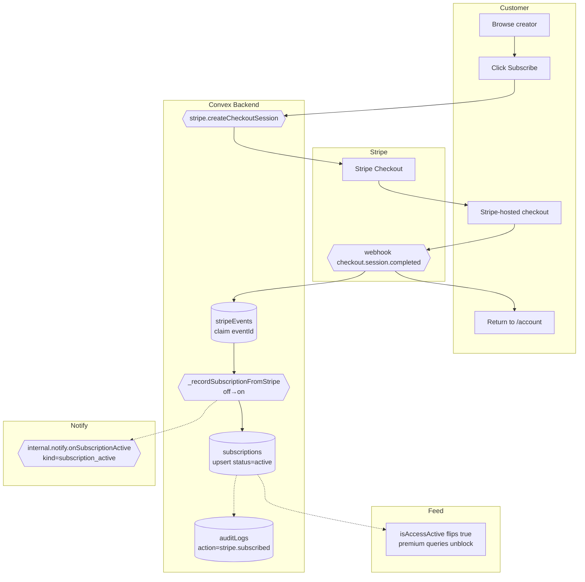

# BPMN-002 — Visitor → subscriber conversion

## Purpose

A visitor (or signed-in customer) discovers a creator, hits a paywall,
checks out via Stripe, and gains access to premium content in
realtime. Access is gated by `subscriptions.status` via the
`isAccessActive(sub)` helper — there is no separate `entitlements`
table.

## Trigger

Visitor clicks **Subscribe** on a `PriceCard` for a creator's tier.

## Preconditions

- Creator exists and is `verified=true`.
- Tier exists in `pricingTiers` and is not archived.
- Stripe account is configured for the creator (or the platform tenant).

## Actors / Swimlanes

- **Visitor / Customer**
- **Convex Backend** — `subscriptions`, `pricingTiers`,
  `stripeEvents` (webhook idempotency).
- **Stripe** — Checkout + webhook.
- **Notify** — `internal.notify.onSubscriptionActive` lifecycle dispatch
  (push / email / telegram / in-app).
- **Feed** — realtime subscription queries gated by `isAccessActive`.

## Main flow

## Alternative flows

- **Card declined** → Stripe stays on Checkout; no subscription row.
- **Webhook replay** → `internal.stripeIdempotency.claim` short-circuits
  on duplicate `stripeEvents.eventId` so the rest of the handler is a
  no-op.
- **Trial selected** → `trialDays` from tier copies into subscription;
  `status='trialing'`; `isAccessActive` returns true.
- **Visitor not signed in** → checkout collects email; webhook creates a
  `users` row + magic-link invite.

## Postconditions

- `subscriptions` row with `status` ∈ {`active`, `trialing`}.
- `isAccessActive(sub)` returns true; premium queries unblock for the
  customer.
- One `stripeEvents` row keyed by `eventId` (idempotency receipt).
- Audit row `stripe.subscribed`.
- Stripe `customer_id` stored on `users`.
- One in-app `notifications` row (`kind='subscription_active'`,
  lifecycle — bypasses per-kind toggles).

## Realtime events

- `subscriptions.mine` updates instantly for the customer.
- Premium-gated queries that consult `isAccessActive` re-run.
- Creator's `subscribers.list` admin view auto-refreshes.

## AI interactions

None on the conversion itself. The Copilot may surface upsell prompts
upstream (BPMN-014).

## Module mapping

- [M06 — Access control & entitlements](../modules/M06-access-control-entitlements.md)
- [M07 — Subscription, billing & monetization](../modules/M07-subscription-billing-monetization.md)
- [M13 — Notifications & smart alerts](../modules/M13-notifications-smart-alerts.md)
- [M25 — Platform settings, compliance & audit](../modules/M25-platform-settings-compliance-audit.md)
