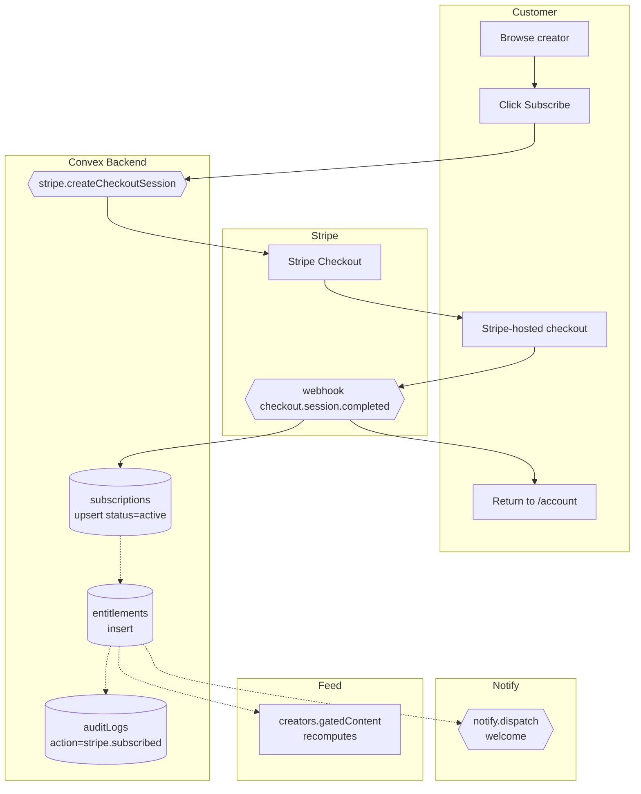

# BPMN-002 — Visitor → subscriber conversion

## Purpose

A visitor (or signed-in customer) discovers a creator, hits a paywall,
checks out via Stripe, and gains entitlement to premium content in
realtime.

## Trigger

Visitor clicks **Subscribe** on a `PriceCard` for a creator's tier.

## Preconditions

- Creator exists and is `verified=true`.
- Tier exists in `pricingTiers` and is not archived.
- Stripe account is configured for the creator (or the platform tenant).

## Actors / Swimlanes

- **Visitor / Customer**
- **Convex Backend** — `subscriptions`, `entitlements`, `pricingTiers`.
- **Stripe** — Checkout + webhook.
- **Notify** — push, email, telegram, discord fanout.
- **Feed** — realtime subscription queries.

## Main flow

## Alternative flows

- **Card declined** → Stripe stays on Checkout; no subscription row.
- **Webhook missed** → idempotent webhook handler reconciles on retry
  (`stripeEvents` dedupe table).
- **Trial selected** → `trialDays` from tier copies into subscription;
  `status='trialing'`; entitlement still granted.
- **Visitor not signed in** → checkout collects email; webhook creates a
  `users` row + magic-link invite.

## Postconditions

- `subscriptions` row with `status` ∈ {`active`, `trialing`}.
- One or more `entitlements` rows.
- Audit row `stripe.subscribed`.
- Stripe `customer_id` stored on `users`.

## Realtime events

- `creators.gatedContent` query flips premium content visible.
- `subscriptions.mine` updates instantly for the customer.
- Creator's `subscribers.list` admin view auto-refreshes.

## AI interactions

None on the conversion itself. The Copilot may surface upsell prompts
upstream (BPMN-014).

## Module mapping

- [M03 — Subscriptions & payments](../modules/M03-subscriptions-payments.md)
- [M15 — Following & access](../modules/M15-following-access.md)
- [M22 — Audit log](../modules/M22-audit-log.md)
