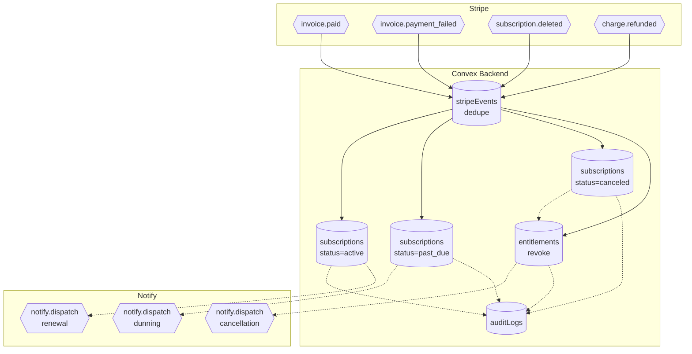

# BPMN-003 — Customer subscription lifecycle

## Purpose

End-to-end state machine for a paid subscription: renew, fail, recover,
cancel, refund.

## Trigger

Stripe webhook events (`invoice.paid`, `invoice.payment_failed`,
`customer.subscription.updated`, `customer.subscription.deleted`,
`charge.refunded`).

## Preconditions

- Active row in `subscriptions` from BPMN-002.
- `STRIPE_WEBHOOK_SECRET` env var configured; HMAC verification on every
  inbound POST.

## Actors / Swimlanes

- **Stripe**
- **Convex Backend** — `subscriptions`, `entitlements`, `auditLogs`,
  `stripeEvents` (idempotency).
- **Notify** — dunning + cancellation comms.
- **Customer** — sees state in `/account/subscriptions`.

## Main flow

## Alternative flows

- **Grace period** — `past_due` keeps entitlement for `gracePeriodDays`
  (default 3). After expiry, entitlement revoked but row stays for
  reactivation.
- **Reactivation** — customer fixes card → `invoice.paid` → status flips
  back to `active`; entitlement re-granted.
- **Refund** — `charge.refunded` reverses entitlement and writes a
  `payment.refund` audit row.
- **Webhook replay** — `stripeEvents.eventId` unique constraint short-
  circuits replays.

## Postconditions

- `subscriptions.status` reflects current Stripe state.
- `entitlements` are pruned for terminal states.
- Audit log captures every transition (append-only).

## Realtime events

- `subscriptions.mine` updates the customer dashboard.
- `creators.gatedContent` re-computes for the affected creator.

## AI interactions

None (the Copilot may answer "why was I charged?" via the audit query
tool — see BPMN-014).

## Module mapping

- [M03 — Subscriptions & payments](../modules/M03-subscriptions-payments.md)
- [M22 — Audit log](../modules/M22-audit-log.md)
