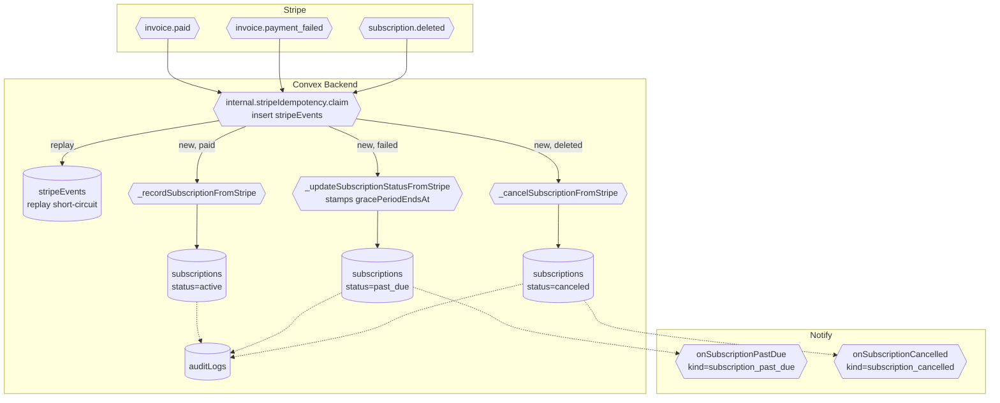

# BPMN-003 — Customer subscription lifecycle

## Purpose

End-to-end state machine for a paid subscription: renew, fail (with
grace window), recover, cancel. Refunds via the Stripe API are
DEFERRED — see §Alternative flows. Access is gated by
`subscriptions.status` via the `isAccessActive(sub)` helper, which
honors a `gracePeriodEndsAt` window during `past_due`.

## Trigger

Stripe webhook events (`invoice.paid`, `invoice.payment_failed`,
`customer.subscription.updated`, `customer.subscription.deleted`).

## Preconditions

- Active row in `subscriptions` from BPMN-002.
- `STRIPE_WEBHOOK_SECRET` env var configured; HMAC verification on every
  inbound POST.
- Webhook idempotency: every inbound event runs through
  `internal.stripeIdempotency.claim` which inserts into `stripeEvents`
  (`eventId` unique) and short-circuits replays.

## Actors / Swimlanes

- **Stripe**
- **Convex Backend** — `subscriptions` (status + `gracePeriodEndsAt`),
  `auditLogs`, `stripeEvents` (idempotency receipts).
- **Notify** — lifecycle dispatches:
  `internal.notify.onSubscriptionPastDue` and
  `internal.notify.onSubscriptionCancelled`. Lifecycle kinds bypass
  per-kind toggles.
- **Customer** — sees state in `/account/subscriptions`.

## Main flow

## Alternative flows

- **Grace period** — on `past_due`, `_updateSubscriptionStatusFromStripe`
  stamps `subscriptions.gracePeriodEndsAt = now + GRACE_PERIOD_DAYS`
  (default 3 days, override via `GRACE_PERIOD_DAYS` env). While inside
  the window, `isAccessActive(sub)` still returns true. After expiry,
  premium queries gate off but the row stays for reactivation.
- **Reactivation** — customer fixes card → `invoice.paid` →
  `_recordSubscriptionFromStripe` flips status back to `active` and
  schedules `onSubscriptionActive` only on off→on transitions.
- **Refund (DEFERRED)** — there is no `charge.refunded` handler today;
  the Stripe refund admin action lives behind a future code path.
  Manual override flows through dispute resolution (BPMN-011).
- **Webhook replay** — `internal.stripeIdempotency.claim` inserts the
  event into `stripeEvents`; the unique `eventId` constraint
  short-circuits replays before any state transition runs.

## Postconditions

- `subscriptions.status` reflects current Stripe state.
- `subscriptions.gracePeriodEndsAt` stamped on past_due transition.
- `stripeEvents` row stored per processed `eventId` (idempotency).
- Audit log captures every transition (append-only).
- Lifecycle `notifications` rows for `subscription_past_due` /
  `subscription_cancelled` (bypass per-kind toggles).

## Realtime events

- `subscriptions.mine` updates the customer dashboard.
- Premium-gated queries that consult `isAccessActive` re-run for the
  affected creator's audience.

## AI interactions

None (the Copilot may answer "why was I charged?" via the audit query
tool — see BPMN-014).

## Module mapping

- [M06 — Access control & entitlements](../modules/M06-access-control-entitlements.md)
- [M07 — Subscription, billing & monetization](../modules/M07-subscription-billing-monetization.md)
- [M13 — Notifications & smart alerts](../modules/M13-notifications-smart-alerts.md)
- [M25 — Platform settings, compliance & audit](../modules/M25-platform-settings-compliance-audit.md)
