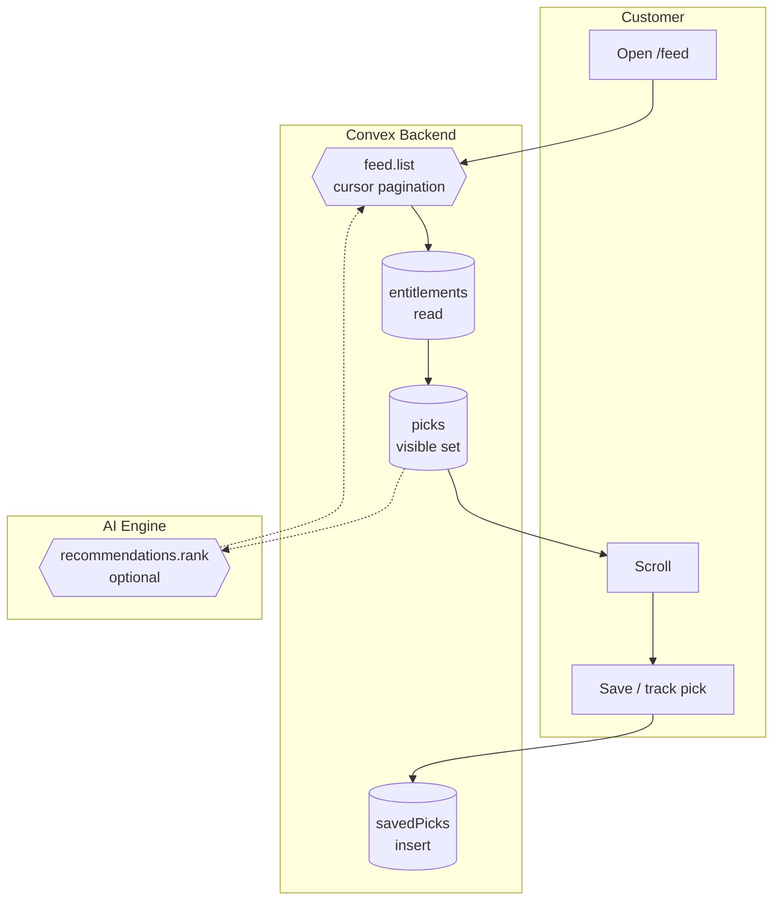

# BPMN-004 — Customer feed consumption

## Purpose

A customer opens their feed and consumes a personalized, realtime stream
of picks — including premium content where they hold entitlement.

## Trigger

Customer navigates to `/feed` (or any feed-bearing page).

## Preconditions

- Customer is authenticated.
- Some creators / picks exist.

## Actors / Swimlanes

- **Customer**
- **Convex Backend** — `feed.list`, `picks`, `entitlements`,
  `recommendations`.
- **AI Engine** — optional ranking / summary tool calls.
- **Notify** — line-movement + pick-published alerts (BPMN-005, -015).

## Main flow

## Alternative flows

- **No entitlement to a premium pick** → `picks.body` is redacted;
  `PickCard` renders the upsell variant linking to BPMN-002.
- **Cursor exhausted** → empty page; UI shows the friendly EmptyState.
- **Realtime new pick during session** → Convex subscription pushes the
  new row; UI prepends without a refresh.

## Postconditions

- `savedPicks` row written when the customer taps save.
- `picks.viewedBy` (analytics counter) bumped via internal mutation.

## Realtime events

- `feed.list` re-runs whenever a new `picks` row is inserted that the
  customer is entitled to.
- `lineMovement.alerts` pings via push (BPMN-005).

## AI interactions

- Optional `recommendations.rank` action — Claude Haiku ranks the
  candidate set. Used only when the customer's history is sparse.

## Module mapping

- [M07 — Feed & discovery](../modules/M07-feed-discovery.md)
- [M14 — Recommendations](../modules/M14-recommendations.md)
- [M15 — Following & access](../modules/M15-following-access.md)
