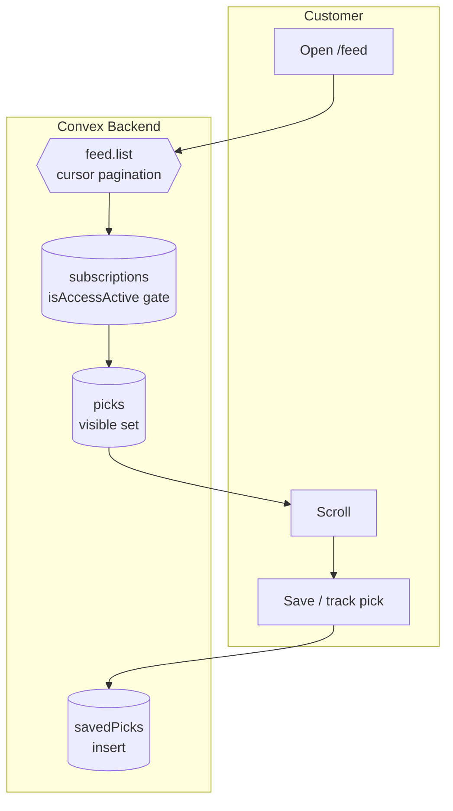

# BPMN-004 — Customer feed consumption

## Purpose

A customer opens their feed and consumes a personalized, realtime stream
of picks — including premium content where they hold entitlement.

## Trigger

Customer navigates to `/feed` (or any feed-bearing page).

## Preconditions

- Customer is authenticated.
- Some creators / picks exist.

## Actors / Swimlanes

- **Customer**
- **Convex Backend** — `feed.list`, `picks`, `subscriptions`
  (`isAccessActive` access gate).
- **Notify** — line-movement + pick-published alerts (BPMN-005, -015).

## Main flow

## Alternative flows

- **No active subscription for a premium pick** → `isAccessActive(sub)`
  is false; `picks.body` is redacted and `PickCard` renders the upsell
  variant linking to BPMN-002.
- **Cursor exhausted** → empty page; UI shows the friendly EmptyState.
- **Realtime new pick during session** → Convex subscription pushes the
  new row; UI prepends without a refresh.
- **AI-ranked feed (DEFERRED)** — semantic ranking / personalization on
  `feed.list` is reserved for a future iteration. Today the feed is
  ordered chronologically with cursor pagination.

## Postconditions

- `savedPicks` row written when the customer taps save.
- `picks.viewedBy` (analytics counter) bumped via internal mutation.

## Realtime events

- `feed.list` re-runs whenever a new `picks` row is inserted that the
  customer is entitled to.
- `lineMovement.alerts` pings via push (BPMN-005).

## AI interactions

None on the feed today. AI ranking is DEFERRED — see §Alternative flows.
The Copilot (BPMN-014) is a separate surface a customer can open from
`/account/copilot`.

## Module mapping

- [M06 — Access control & entitlements](../modules/M06-access-control-entitlements.md)
- [M10 — Customer feed & discovery](../modules/M10-customer-feed-discovery.md)
- [M13 — Notifications & smart alerts](../modules/M13-notifications-smart-alerts.md)
- [M18 — Saved library & watchlists](../modules/M18-saved-library-watchlists.md)
