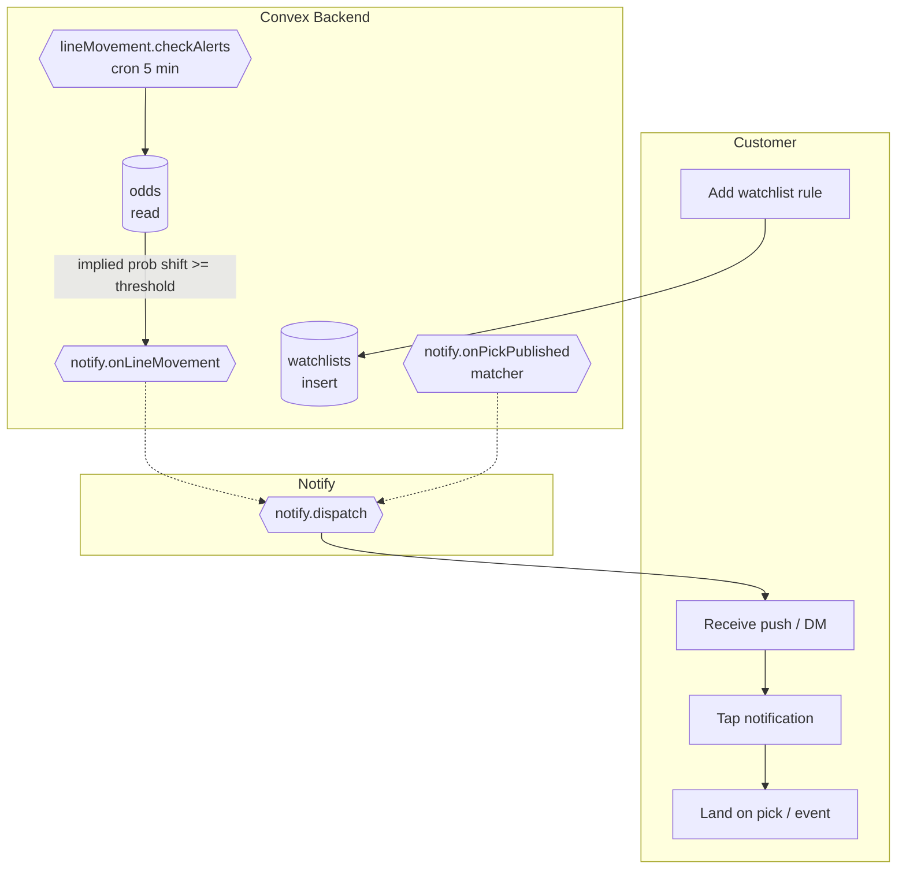

# BPMN-005 — Customer tracking & watchlists

## Purpose

Customers track creators / events / odds movements and receive realtime
alerts on triggers.

## Trigger

- Customer creates a watchlist rule.
- `lineMovement.checkAlerts` (cron) detects a movement ≥ threshold.
- A pick is published that matches a saved rule.

## Preconditions

- Customer is authenticated.
- Notification preferences are set (or default channels are in effect).

## Actors / Swimlanes

- **Customer**
- **Convex Backend** — `watchlists`, `lineMovement`, `notify`.
- **Notify** — push / telegram / discord / email channels.

## Main flow

## Alternative flows

- **Threshold not crossed** → no notification; cursor advances.
- **Notification channel unavailable** → queued + retried with backoff
  (BPMN-015).
- **Watchlist rule disabled** → cron skips the row.
- **Duplicate movement within debounce window** → suppressed
  (`lineMovement.lastNotifiedAt`).

## Postconditions

- `watchlists` row owns the rule.
- `notifications` (audit) row written per fanout.
- `lineMovement.lastNotifiedAt` patched to suppress dupes.

## Realtime events

- `watchlists.mine` reflects the new rule for the customer.
- `notifications.mine` shows the inbox entry.

## AI interactions

None directly. Optional: Copilot can answer "why did I get this alert?"
via the audit query tool.

## Module mapping

- [M14 — Recommendations](../modules/M14-recommendations.md)
- [M19 — Notifications & realtime](../modules/M19-notifications-realtime.md)
