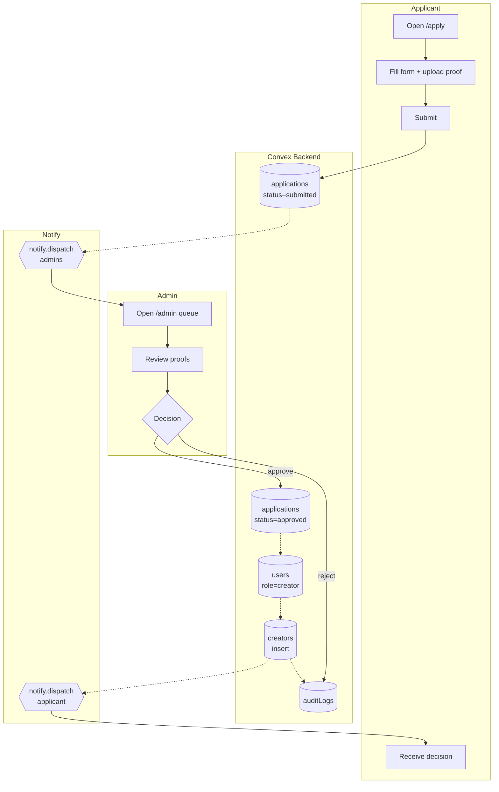

# BPMN-006 — Creator application & verification

## Purpose

A user applies to become a creator, uploads proof, and is reviewed by an
admin. On approval the user gains the `creator` role and a `creators`
row.

## Trigger

User submits the creator application at `/apply`.

## Preconditions

- User is authenticated.
- No existing application in `submitted` / `review` status for this user.

## Actors / Swimlanes

- **Applicant (user)**
- **Convex Backend** — `applications`, `creators`, `users`, `auditLogs`.
- **Admin** — `/admin` review queue.
- **Notify** — applicant + admin channels.
- **Storage** — Convex file storage for proof uploads.

## Main flow

## Alternative flows

- **Reject** → `applications.status='rejected'`, applicant notified;
  reapply blocked for `cooldownDays` (default 30).
- **Flag for review** → `status='flagged'` enters the trust-ops queue
  (BPMN-010).
- **Proof upload fails** → applicant retries; no `applications` row is
  written until submit succeeds atomically.
- **Approval revoked later** → admin sets `creators.suspended=true`;
  audit row written; downstream queries filter the creator out.

## Postconditions

- `applications.status` ∈ {`approved`, `rejected`, `flagged`}.
- On approval: `users.role='creator'`, `users.creatorId` set, `creators`
  row exists with default tiers seeded.
- Audit rows for every state transition (append-only).

## Realtime events

- Admin queue counter (`admin.summary.pendingApplications`) updates live.
- Applicant's `applications.mine` flips status without refresh.

## AI interactions

- Optional: Anthropic Haiku scores the application narrative for
  authenticity signals. Score lands on
  `applications.aiAuthenticityScore`. Score never auto-rejects — it's a
  hint for the admin queue.

## Module mapping

- [M02 — Roles & permissions](../modules/M02-roles-permissions.md)
- [M04 — Creator profile & onboarding](../modules/M04-creator-profile-onboarding.md)
- [M16 — Admin & moderation](../modules/M16-admin-moderation.md)
- [M22 — Audit log](../modules/M22-audit-log.md)
