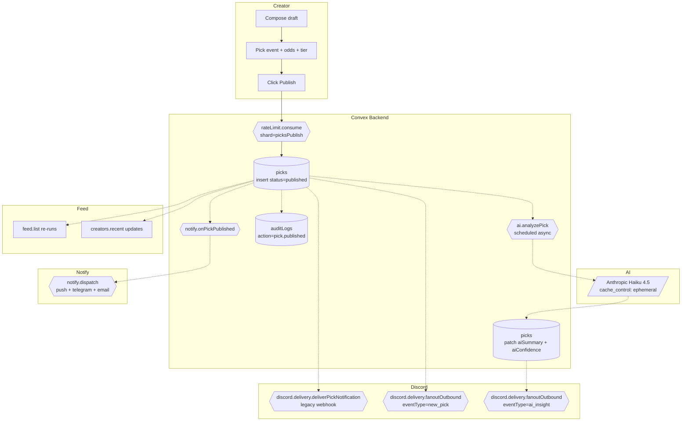

# BPMN-007 — Creator pick publishing

## Purpose

A creator drafts a pick, attaches an event + odds + tier gating, and
publishes it. The system fans out to subscribers via every configured
channel and surfaces the pick in the realtime feed.

## Trigger

Creator clicks **Publish** on `/dashboard/create`.

## Preconditions

- Creator is authenticated, role ∈ {`creator`, `admin`}.
- Creator's `creators.suspended` is false.
- Event exists and is in `scheduled` or `live` state.
- For premium picks: at least one paid `pricingTiers` row exists.
- Rate-limit token available on the `picksPublish` shard.

## Actors / Swimlanes

- **Creator**
- **Convex Backend** — `picks`, `events`, `auditLogs`.
- **AI Engine** — optional `ai.cowrite` for pre-publish suggestion;
  post-publish `ai.analyzePick` runs async to fill `aiSummary` /
  `aiConfidence` / `aiReasoning`.
- **Notify** — per-user fanout: push / telegram / email (BPMN-015).
- **Discord** — per-creator outbound. Two paths:
  `discord.delivery.deliverPickNotification` (legacy single webhook on
  `creators.discordWebhookUrl`) and `discord.delivery.fanoutOutbound`
  (new multi-channel flow keyed off `discordChannelSyncs`). Both fire
  fire-and-forget; failures land in `discordDeliveryLogs` and never
  block publish.
- **Feed** — realtime subscription queries.

## Main flow

## Alternative flows

- **Premium pick, no entitlement on the customer side** → fanout still
  fires, but the rendered card shows the upsell variant (BPMN-002).
- **Rate-limit exceeded** → `picks.publish` throws
  `RATE_LIMITED`; UI surfaces a cool-down banner.
- **Watchlist match** (BPMN-005) → `notify.onPickPublished` runs the
  matcher and queues an extra alert.
- **AI co-write fails** → the pick is published without an AI summary;
  the creator can re-run the action manually.
- **Creator suspended mid-publish** → mutation rejects with
  `SUSPENDED`; no row written.

## Postconditions

- `picks` row with `grade='pending'`.
- Async-filled `aiSummary` / `aiConfidence` / `aiReasoning` from
  `ai.analyzePick` (no-op if `ANTHROPIC_API_KEY` is unset).
- Audit row `pick.published`.
- One row in `notifications` per channel × subscriber (push / telegram /
  email path — see BPMN-015).
- For each enabled outbound `discordChannelSyncs` row on the creator,
  one `discordDeliveryLogs` row per Discord post (`new_pick` and, once
  the AI analysis lands, `ai_insight`). Legacy creators on
  `creators.discordWebhookUrl` get a single `deliverPickNotification`
  delivery row instead — the two paths are mutually exclusive: the
  legacy fallback short-circuits when any `discordChannelSyncs` row
  exists for the creator.

## Realtime events

- `feed.list` and `creators.recent` re-run for every entitled customer.
- Creator's `dashboard/picks` table gains the new row.

## AI interactions

- `ai.suggestPick` (pre-publish, optional). Anthropic Haiku 4.5 with the
  shared prompt-cached system block. Returns a draft summary +
  confidence + reasoning the creator can accept; never publishes
  unapproved content.
- `ai.analyzePick` (post-publish, scheduled async). Same Haiku model
  and system prompt — intentionally so that both paths share the
  Anthropic prompt cache. On completion, schedules
  `discord.delivery.fanoutOutbound` with `eventType='ai_insight'` for
  creators with the `aiInsight` alert rule on. Quietly skips when
  `ANTHROPIC_API_KEY` is unset.

## Module mapping

- [M05 — Picks publishing engine](../modules/M05-picks-publishing-engine.md)
- [M12 — AI intelligence engine](../modules/M12-ai-intelligence-engine.md)
- [M13 — Notifications & smart alerts](../modules/M13-notifications-smart-alerts.md)
- [M20 — Discord integration](../modules/M20-discord-integration.md)
- [M25 — Platform settings, compliance & audit](../modules/M25-platform-settings-compliance-audit.md)
