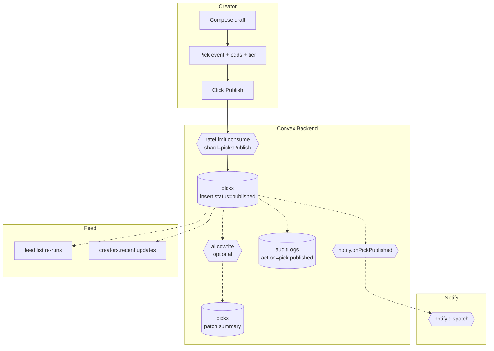

# BPMN-007 — Creator pick publishing

## Purpose

A creator drafts a pick, attaches an event + odds + tier gating, and
publishes it. The system fans out to subscribers via every configured
channel and surfaces the pick in the realtime feed.

## Trigger

Creator clicks **Publish** on `/dashboard/create`.

## Preconditions

- Creator is authenticated, role ∈ {`creator`, `admin`}.
- Creator's `creators.suspended` is false.
- Event exists and is in `scheduled` or `live` state.
- For premium picks: at least one paid `pricingTiers` row exists.
- Rate-limit token available on the `picksPublish` shard.

## Actors / Swimlanes

- **Creator**
- **Convex Backend** — `picks`, `events`, `entitlements`, `auditLogs`.
- **AI Engine** — optional `ai.cowrite` action for summaries.
- **Notify** — fanout to push / telegram / discord / email.
- **Feed** — realtime subscription queries.

## Main flow

## Alternative flows

- **Premium pick, no entitlement on the customer side** → fanout still
  fires, but the rendered card shows the upsell variant (BPMN-002).
- **Rate-limit exceeded** → `picks.publish` throws
  `RATE_LIMITED`; UI surfaces a cool-down banner.
- **Watchlist match** (BPMN-005) → `notify.onPickPublished` runs the
  matcher and queues an extra alert.
- **AI co-write fails** → the pick is published without an AI summary;
  the creator can re-run the action manually.
- **Creator suspended mid-publish** → mutation rejects with
  `SUSPENDED`; no row written.

## Postconditions

- `picks` row with `grade='pending'`.
- Possibly an AI-generated `summary` field.
- Audit row `pick.published`.
- One row in `notifications` per channel × subscriber.

## Realtime events

- `feed.list` and `creators.recent` re-run for every entitled customer.
- Creator's `dashboard/picks` table gains the new row.

## AI interactions

- `ai.cowrite` (Anthropic Haiku, prompt-cached system prompt). Returns a
  ≤140-char neutral summary. Never publishes content the creator hasn't
  approved — the action returns text the creator chose to accept.

## Module mapping

- [M08 — Picks publishing](../modules/M08-picks-publishing.md)
- [M14 — Recommendations](../modules/M14-recommendations.md)
- [M19 — Notifications & realtime](../modules/M19-notifications-realtime.md)
- [M22 — Audit log](../modules/M22-audit-log.md)
