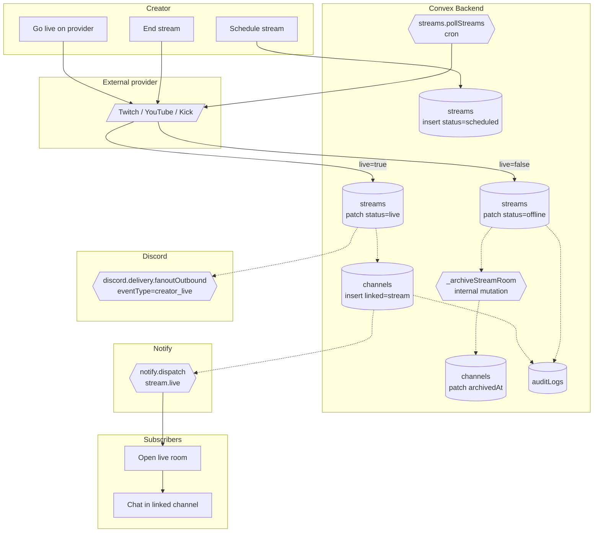

# BPMN-008 — Creator livestream workflow

## Purpose

A creator hosts a livestream tied to an event. The system detects the
live state, notifies subscribers, opens a stream-linked community room,
and closes everything down on stream end.

## Trigger

- Creator schedules a stream → `streams.create` mutation.
- `streams.pollStreams` cron flips status when the upstream provider
  (Twitch / YouTube / Kick) reports the channel as live; on the
  live→offline transition it also schedules the internal mutation
  `_archiveStreamRoom` to archive the linked community channel.

## Preconditions

- Creator authenticated and verified.
- `streams.providerHandle` is set.
- Optional: `eventId` linking the stream to a specific match.

## Actors / Swimlanes

- **Creator**
- **Convex Backend** — `streams`, `channels`, `messages`, `auditLogs`.
- **External provider** — Twitch / YouTube / Kick.
- **Notify** — push / telegram fanout (per-user, BPMN-015).
- **Discord** — per-creator outbound (`discord.delivery.fanoutOutbound`,
  `eventType='creator_live'`). Fires on every offline→live transition
  for creators with an enabled outbound `discordChannelSyncs` row.
- **Subscribers** — open the live room.

## Main flow

## Alternative flows

- **Provider rate-limit / outage** → cron logs warning; status stays at
  last-known. Stream-state UI shows a stale-data badge.
- **Creator forgets to end the stream** → 24-hour TTL auto-closes the
  channel; archived audit row is written.
- **Linked event finishes during the stream** → BPMN-013 runs; pick
  grading happens independently.
- **Stream is restricted (private)** → channel-access gating
  (BPMN-002 entitlements) limits who can join the room.

## Postconditions

- `streams.status` reflects current upstream state (`scheduled` /
  `live` / `offline`).
- A `channels` row exists for the duration of the live state. On the
  live→offline transition, `pollStreams` schedules
  `internal.streams._archiveStreamRoom` which patches `archivedAt` on
  the stream-linked channel.
- Audit rows for every transition.

## Realtime events

- `streams.live` query auto-updates on every status change.
- The linked `channels.messages` query receives new chat in realtime.

## AI interactions

None inline. Post-stream summarization is owned by the Discord inbound
pipeline if a Discord channel is mapped (BPMN-014 + Discord module).

## Module mapping

- [M14 — Community & realtime interaction](../modules/M14-community-realtime-interaction.md)
- [M15 — Livestream integrations](../modules/M15-livestream-integrations.md)
- [M13 — Notifications & smart alerts](../modules/M13-notifications-smart-alerts.md)
- [M20 — Discord integration](../modules/M20-discord-integration.md)
