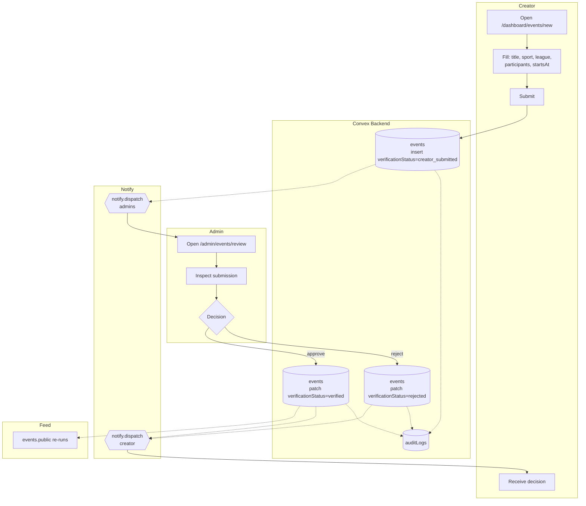

# BPMN-009 — Creator custom event creation

## Purpose

A creator submits a local / regional / niche match that no upstream
provider covers. The system runs it through admin verification and, on
approval, publishes it as a first-class event eligible for picks,
streams, and community rooms. This is the diagram that proves
**provider-agnostic architecture**.

## Trigger

Creator submits a new event at `/dashboard/events/new`.

## Preconditions

- Creator authenticated and verified.
- Event is not duplicate of an existing federated event (same league,
  date, and participants).

## Actors / Swimlanes

- **Creator**
- **Convex Backend** — `events`, `auditLogs`.
- **Admin**
- **Notify** — admin queue + creator decision.
- **Feed** — public events feed.

## Main flow

## Alternative flows

- **Duplicate detection** → mutation rejects with
  `EVENT_DUPLICATE_OF=:eventId` so the creator can converge onto the
  federated row.
- **Need-more-info** → admin patches `verificationStatus='info_needed'`
  with a note; creator gets a resubmit prompt.
- **Rejection appeal** → creator opens a dispute (BPMN-011); audit row
  links the appeal to the original decision.
- **Creator is admin** → still flows through the queue; admin self-review
  is allowed but every transition writes an audit row for traceability.

## Postconditions

- `events.verificationStatus` ∈ {`creator_submitted`, `verified`,
  `rejected`, `info_needed`}.
- On approval, the event is eligible for picks, streams, and grading
  (BPMN-013).
- Audit rows for every state transition.

## Realtime events

- `events.public` re-runs on approval.
- Admin queue counter on `/admin` updates live.
- Creator's `myEvents` query reflects the new state.

## AI interactions

None inline. Optional: a downstream AI dedupe action can compare a
submitted event against the federated catalog and flag likely
duplicates for the admin queue.

## Module mapping

- [M04 — Provider-agnostic event engine](../modules/M04-provider-agnostic-event-engine.md)
- [M17 — Admin operations & moderation](../modules/M17-admin-operations-moderation.md)
- [M23 — Custom event review & federation](../modules/M23-custom-event-review-federation.md)
- [M25 — Platform settings, compliance & audit](../modules/M25-platform-settings-compliance-audit.md)
