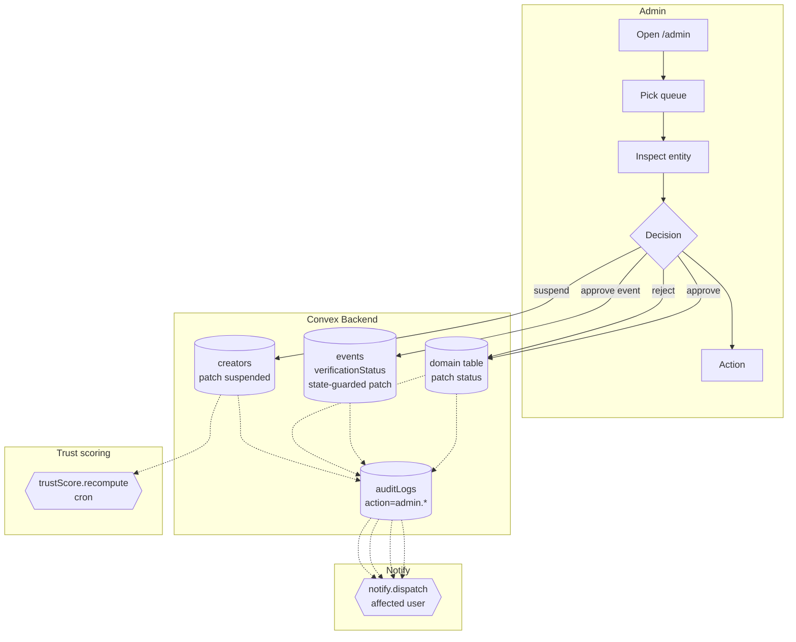

# BPMN-010 — Moderation & review workflow

## Purpose

The cross-cutting admin-side queue: events, applications, flagged
content, and community-rule violations. One mental model for every
"approve / reject / suspend" action.

## Trigger

Admin opens `/admin` (or any sub-queue: `/admin/events/review`,
`/admin/applications`, `/admin/disputes`).

## Preconditions

- Admin authenticated, role ∈ {`super_admin`, `tenant_admin`, `admin`}.
- MFA freshness gate satisfied for sensitive actions
  (`requireMfaFresh`). For event review specifically,
  `events.reviewEvent` calls `gateOnMfaIfEnrolled` so any admin who has
  enrolled MFA must present a fresh code before the transition runs.

## Actors / Swimlanes

- **Admin**
- **Convex Backend** — domain tables (events, applications,
  channels, picks, creators) + `auditLogs`.
- **Notify** — affected user channels.
- **Trust scoring cron** — periodic re-evaluation.

## Main flow

## Alternative flows

- **MFA stale** → action is blocked with `MFA_REQUIRED`; UI prompts a
  fresh TOTP code and retries. `events.reviewEvent` enforces this via
  `gateOnMfaIfEnrolled` for any admin who has enrolled MFA.
- **Event review state guard** → `events.reviewEvent` rejects calls
  against any event whose `verificationStatus` is not
  `creator_submitted` so an already-approved event can't be flipped a
  second time. On accept it stamps `metadata.reviewedAt`, sets
  `reviewedByAdminId`, and writes an `event.review.{approve|reject}`
  audit row inside the same transaction.
- **Stripe refund admin action (DEFERRED)** — there is no admin-initiated
  Stripe refund flow today. Refund-style remediation routes through
  dispute resolution (BPMN-011) which currently records the
  override + audit row but does not call the Stripe API.
- **Bulk approval** → admin selects multiple rows; each transition runs
  inside its own internal mutation so a partial failure leaves the rest
  consistent.
- **Reversal** — admin can re-open a previously rejected entity; the
  audit log keeps the full history (append-only). Reversals never
  rewrite prior audit rows.
- **Self-action** — admins acting on their own entities still flow
  through the queue and write audit rows; trust score reflects this.

## Postconditions

- The target entity's status reflects the admin decision.
- `creators.suspended` flag, `creators.trustScore` may be patched.
- One audit row per decision with `action=admin.<verb>` and the
  acting admin's `userId`.

## Realtime events

- The relevant queue counter on `/admin` updates without refresh.
- Affected users see status changes in their dashboards live.

## AI interactions

- AI-driven trust scoring of recent uploads is DEFERRED. Trust score is
  computed today from rule-based signals only (audit history,
  suspensions, dispute outcomes).

## Module mapping

- [M08 — Creator verification & trust](../modules/M08-creator-verification-trust.md)
- [M17 — Admin operations & moderation](../modules/M17-admin-operations-moderation.md)
- [M23 — Custom event review & federation](../modules/M23-custom-event-review-federation.md)
- [M25 — Platform settings, compliance & audit](../modules/M25-platform-settings-compliance-audit.md)
