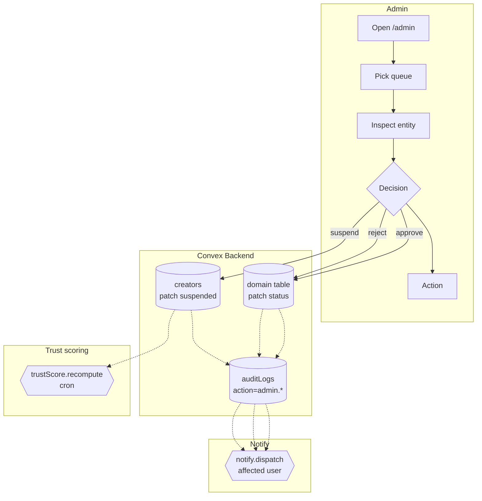

# BPMN-010 — Moderation & review workflow

## Purpose

The cross-cutting admin-side queue: events, applications, flagged
content, and community-rule violations. One mental model for every
"approve / reject / suspend" action.

## Trigger

Admin opens `/admin` (or any sub-queue: `/admin/events/review`,
`/admin/applications`, `/admin/disputes`).

## Preconditions

- Admin authenticated, role ∈ {`super_admin`, `tenant_admin`, `admin`}.
- MFA freshness gate satisfied for sensitive actions
  (`requireMfaFresh`).

## Actors / Swimlanes

- **Admin**
- **Convex Backend** — domain tables (events, applications,
  channels, picks, creators) + `auditLogs`.
- **Notify** — affected user channels.
- **Trust scoring cron** — periodic re-evaluation.

## Main flow

## Alternative flows

- **MFA stale** → action is blocked with `MFA_REQUIRED`; UI prompts a
  fresh TOTP code and retries.
- **Bulk approval** → admin selects multiple rows; each transition runs
  inside its own internal mutation so a partial failure leaves the rest
  consistent.
- **Reversal** — admin can re-open a previously rejected entity; the
  audit log keeps the full history (append-only). Reversals never
  rewrite prior audit rows.
- **Self-action** — admins acting on their own entities still flow
  through the queue and write audit rows; trust score reflects this.

## Postconditions

- The target entity's status reflects the admin decision.
- `creators.suspended` flag, `creators.trustScore` may be patched.
- One audit row per decision with `action=admin.<verb>` and the
  acting admin's `userId`.

## Realtime events

- The relevant queue counter on `/admin` updates without refresh.
- Affected users see status changes in their dashboards live.

## AI interactions

- Optional: trust-score recomputation pulls Anthropic Haiku for
  authenticity scoring of recent uploads. Output is advisory — never
  auto-suspending.

## Module mapping

- [M16 — Admin & moderation](../modules/M16-admin-moderation.md)
- [M17 — Trust & safety](../modules/M17-trust-safety.md)
- [M22 — Audit log](../modules/M22-audit-log.md)
