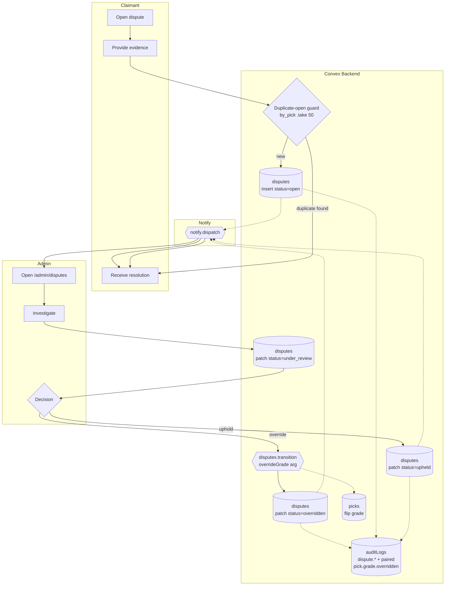

# BPMN-011 — Fraud detection & dispute resolution

## Purpose

A user (customer or creator) opens a dispute against a grade, payment,
or moderation decision. Admin investigates with full audit context and
either upholds or overrides. Override paths are heavily audited and
require fresh MFA.

## Trigger

User clicks **Open dispute** from a graded pick, transaction, or
moderation outcome.

## Preconditions

- User authenticated.
- The target entity exists and is within the dispute window
  (`disputeWindowDays`, default 14).
- No open dispute already exists for the same entity from the same user
  — `disputes.open` runs a bounded scan (`.take(50)` on `by_pick`) and
  returns the existing dispute id if one is found. The duplicate guard
  is idempotent: a re-click is a no-op, not an error.

## Actors / Swimlanes

- **User (claimant)**
- **Convex Backend** — `disputes`, target entity, `auditLogs`.
  `disputes.transition` accepts an optional `overrideGrade` arg; when
  set on a `pick` dispute it flips `picks.grade` and writes a paired
  `pick.grade.overridden` audit row inside the same transaction
  (NFR-006 — the only sanctioned exit from grade immutability).
- **Admin**
- **Notify** — both parties.

## Main flow

## Alternative flows

- **Stripe refund (DEFERRED)** — there is no Stripe refund integration
  on the dispute path today. Admins can override a grade or close the
  dispute upheld; monetary remediation requires a future code path that
  calls `refunds.create`.
- **MFA stale on override** → action blocked; admin re-authenticates.
- **Multiple disputes per entity** → consolidated by `entityId`; the
  decision applies to all.
- **Grading override** — even though grades are normally immutable
  (NFR-006), `disputes.transition({ overrideGrade })` is the explicit,
  audited override channel. The transition flips `picks.grade` and
  writes a paired `pick.grade.overridden` audit row in the same
  transaction.

## Postconditions

- `disputes.status` ∈ {`open`, `under_review`, `upheld`,
  `overridden`}.
- On override with `overrideGrade`: `picks.grade` is flipped and a
  paired `pick.grade.overridden` audit row is written in the same
  transaction.
- Audit rows on every transition.

## Realtime events

- Both parties' `disputes.mine` queries update without refresh.
- Admin queue counter (`admin.summary`) reflects the new pending count.

## AI interactions

- AI-driven anomaly detection over grading patterns is DEFERRED. Today
  the admin queue is rule-based; admins read evidence directly.

## Module mapping

- [M09 — Pick grading & performance](../modules/M09-pick-grading-performance.md)
- [M17 — Admin operations & moderation](../modules/M17-admin-operations-moderation.md)
- [M25 — Platform settings, compliance & audit](../modules/M25-platform-settings-compliance-audit.md)
