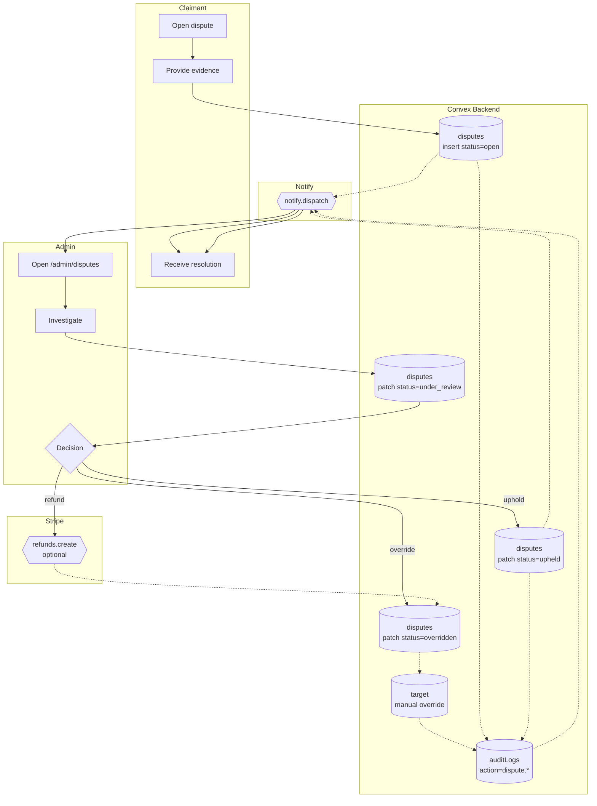

# BPMN-011 — Fraud detection & dispute resolution

## Purpose

A user (customer or creator) opens a dispute against a grade, payment,
or moderation decision. Admin investigates with full audit context and
either upholds or overrides. Override paths are heavily audited and
require fresh MFA.

## Trigger

User clicks **Open dispute** from a graded pick, transaction, or
moderation outcome.

## Preconditions

- User authenticated.
- The target entity exists and is within the dispute window
  (`disputeWindowDays`, default 14).
- No open dispute already exists for the same entity from the same user.

## Actors / Swimlanes

- **User (claimant)**
- **Convex Backend** — `disputes`, target entity, `auditLogs`.
- **Admin**
- **Notify** — both parties.
- **Stripe** — refund path (only when an admin chooses the refund
  outcome).

## Main flow

## Alternative flows

- **Stripe refund fails** → dispute stays in `under_review`; admin gets
  a banner and retries. A failed refund never silently closes the
  dispute.
- **MFA stale on override** → action blocked; admin re-authenticates.
- **Multiple disputes per entity** → consolidated by `entityId`; the
  decision applies to all.
- **Grading override** — even though grades are normally immutable
  (NFR-006), the dispute resolution path is the explicit, audited
  override channel. Every override writes a `pick.grade.overridden`
  audit row alongside the dispute resolution.

## Postconditions

- `disputes.status` ∈ {`open`, `under_review`, `upheld`,
  `overridden`}.
- On override: target entity is patched (e.g., grade flipped, refund
  issued, suspension lifted).
- Audit rows on every transition + a paired `*.overridden` row on the
  target entity for overrides.

## Realtime events

- Both parties' `disputes.mine` queries update without refresh.
- Admin queue counter (`admin.summary`) reflects the new pending count.

## AI interactions

- Optional: anomaly detection ranks suspicious grading patterns for the
  admin queue. Output never auto-resolves a dispute.

## Module mapping

- [M16 — Admin & moderation](../modules/M16-admin-moderation.md)
- [M17 — Trust & safety](../modules/M17-trust-safety.md)
- [M22 — Audit log](../modules/M22-audit-log.md)
