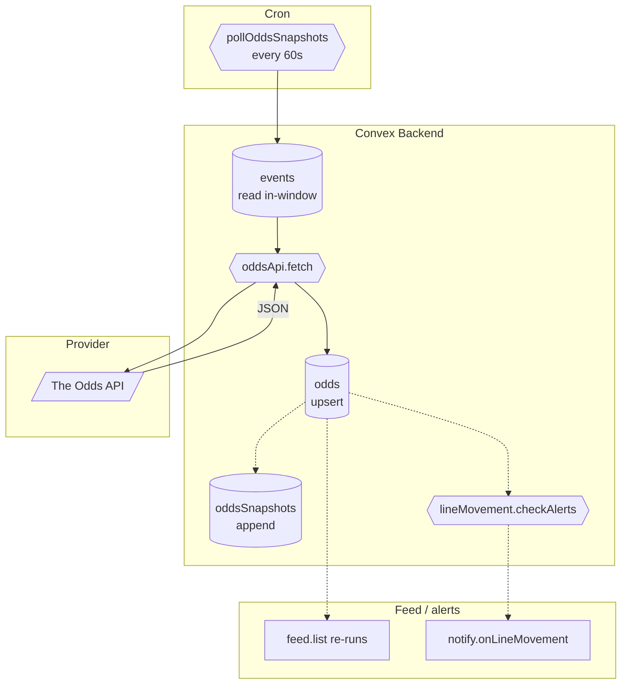

# BPMN-012 — Realtime odds synchronization

## Purpose

Periodic ingest of odds from external providers, normalization to the
DigiPicks schema, and propagation to the feed and watchlist alerts.

## Trigger

- Cron `pollOddsSnapshots` runs every 60 seconds.
- Manual `oddsApi.refreshNow` from `/admin` for a specific event.

## Preconditions

- `ODDS_API_KEY` env var configured (otherwise the action is a quiet
  no-op and emits a single startup warning).
- Events exist in `scheduled` or `live` state for in-window dates.

## Actors / Swimlanes

- **Cron**
- **Convex Backend** — `events`, `odds`, `oddsSnapshots`,
  `lineMovement`.
- **External provider** — The Odds API (or equivalent).
- **Feed / alerts** — fanout consumers.

## Main flow

## Alternative flows

- **Provider rate-limit (HTTP 429)** → exponential backoff, retry on
  next tick; metric counter increments.
- **Stale data (cache miss)** → log warning + fall back to the most
  recent snapshot; UI shows a "stale odds" badge.
- **Schema drift** → unknown markets are dropped with a metric counter;
  known markets continue to update.
- **Webhook variant** — for providers that support it, an HTTP action
  endpoint replaces the poll; the rest of the diagram is identical.

## Postconditions

- `odds` table reflects the latest snapshot per `(eventId, market)`.
- `oddsSnapshots` keeps a time series for line-movement detection.
- `lineMovement.lastNotifiedAt` patched when an alert fires.

## Realtime events

- `feed.list`, `events.detail`, and `oddsIntel.*` queries auto-update
  on every odds change.
- Watchlist subscribers (BPMN-005) receive push when implied
  probability shifts ≥ threshold.

## AI interactions

None on the ingest path. The `oddsIntel` page may call Anthropic Haiku
for explanatory text, but that's read-side and unrelated to ingest.

## Module mapping

- [M06 — Odds ingestion & intel](../modules/M06-odds-intel.md)
- [M14 — Recommendations](../modules/M14-recommendations.md)
- [M19 — Notifications & realtime](../modules/M19-notifications-realtime.md)
