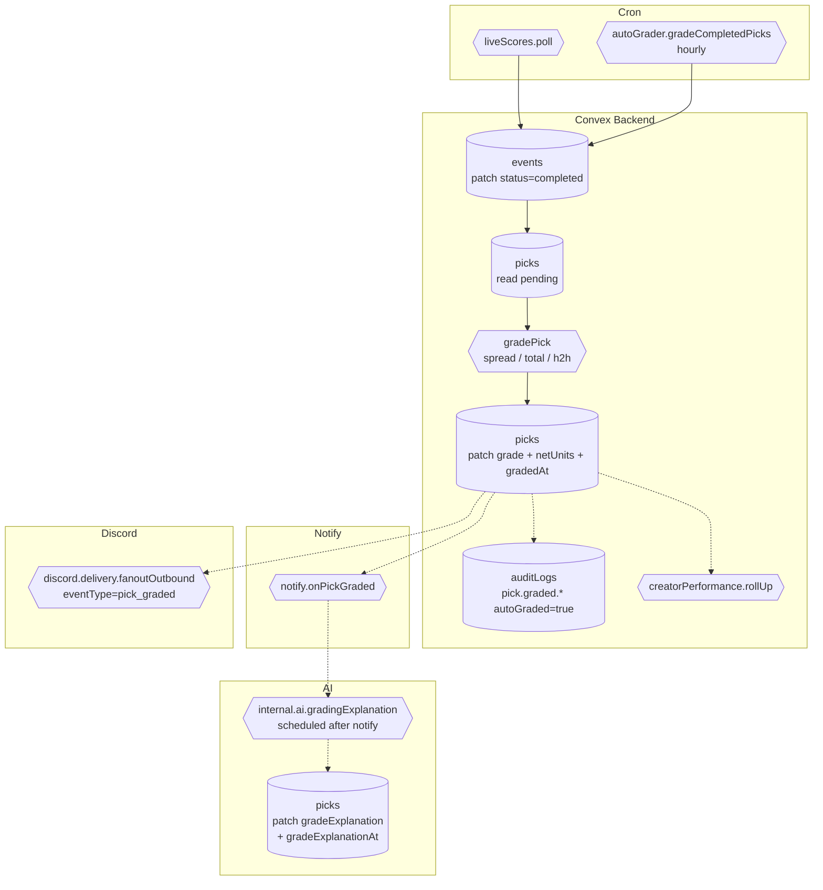

# BPMN-013 — Pick grading workflow

## Purpose

When an event completes, every pending pick on it is auto-graded
(win / loss / push / void) with NFR-006 grade immutability. The
grading run feeds analytics, performance, and downstream notifications.

## Trigger

- Cron `liveScores.poll` flips `events.status` to `completed` once the
  upstream score provider reports the final.
- Cron `autoGrader.gradeCompletedPicks` runs hourly and grades pending
  picks on completed events.
- Admin manual override path (rare; runs through BPMN-011).

## Preconditions

- Event has `status='completed'` and both `homeScore` /
  `awayScore` are numeric.
- Picks on the event have `grade='pending'`.

## Actors / Swimlanes

- **Cron**
- **Convex Backend** — `events`, `picks`, `auditLogs`,
  `creatorPerformance`.
- **AI Engine** — `internal.ai.gradingExplanation`. After notify
  dispatch, `picks.grade` schedules this internal action; on completion
  it patches `picks.gradeExplanation` (and `gradeExplanationAt`) with a
  neutral one-liner produced by Anthropic Haiku (prompt-cached).
- **Notify** — pick-graded fanout (per-user, BPMN-015).
- **Discord** — per-creator outbound fanout
  (`discord.delivery.fanoutOutbound`, `eventType='pick_graded'`).
  Fires on every grade transition for creators with an enabled outbound
  `discordChannelSyncs` row + the `pickGraded` alert rule on.
- **Customer feed** — `results.mine`, creator `Performance`.

## Main flow

## Alternative flows

- **Unparseable line** → the pick stays `pending`; admin can grade
  manually. Counter increments on the auto-grader observability card
  (`/admin`).
- **Spread mascot collision** (e.g., both teams share a city) → grader
  bails to `pending` rather than guess; admin handles it.
- **Late score correction** → upstream provider patches the score;
  because grades are immutable (NFR-006), correction flows through the
  dispute path (BPMN-011) which writes a `pick.grade.overridden` audit
  row.
- **Re-run safety** → `_gradeOnePick` short-circuits when
  `pick.grade !== 'pending'`. Re-running the cron is safe.

## Postconditions

- `picks.grade` ∈ {`win`, `loss`, `push`, `void`}.
- `picks.netUnits` reflects the resolved P&L.
- One `pick.graded.<grade>` audit row per pick with
  `metadata.autoGraded=true` (or `false` for admin overrides).
- `creatorPerformance` rollup updated (win rate, ROI, units).

## Realtime events

- `picks.mine`, `results.mine`, and creator `Performance` queries
  auto-update.
- Admin auto-grader observability section (`/admin`) reflects the
  latest counts.

## AI interactions

- `internal.ai.gradingExplanation` (Anthropic Haiku, prompt-cached) is
  scheduled after notify dispatch. It produces a neutral one-liner
  ("Took -3.5; final 27-21, covered by 2.5") and patches
  `picks.gradeExplanation` + `picks.gradeExplanationAt`. Quietly skips
  when `ANTHROPIC_API_KEY` is unset (symmetric with `analyzePick` /
  `suggestPick`).

## Module mapping

- [M09 — Pick grading & performance](../modules/M09-pick-grading-performance.md)
- [M12 — AI intelligence engine](../modules/M12-ai-intelligence-engine.md)
- [M13 — Notifications & smart alerts](../modules/M13-notifications-smart-alerts.md)
- [M16 — Creator analytics dashboard](../modules/M16-creator-analytics-dashboard.md)
- [M25 — Platform settings, compliance & audit](../modules/M25-platform-settings-compliance-audit.md)
