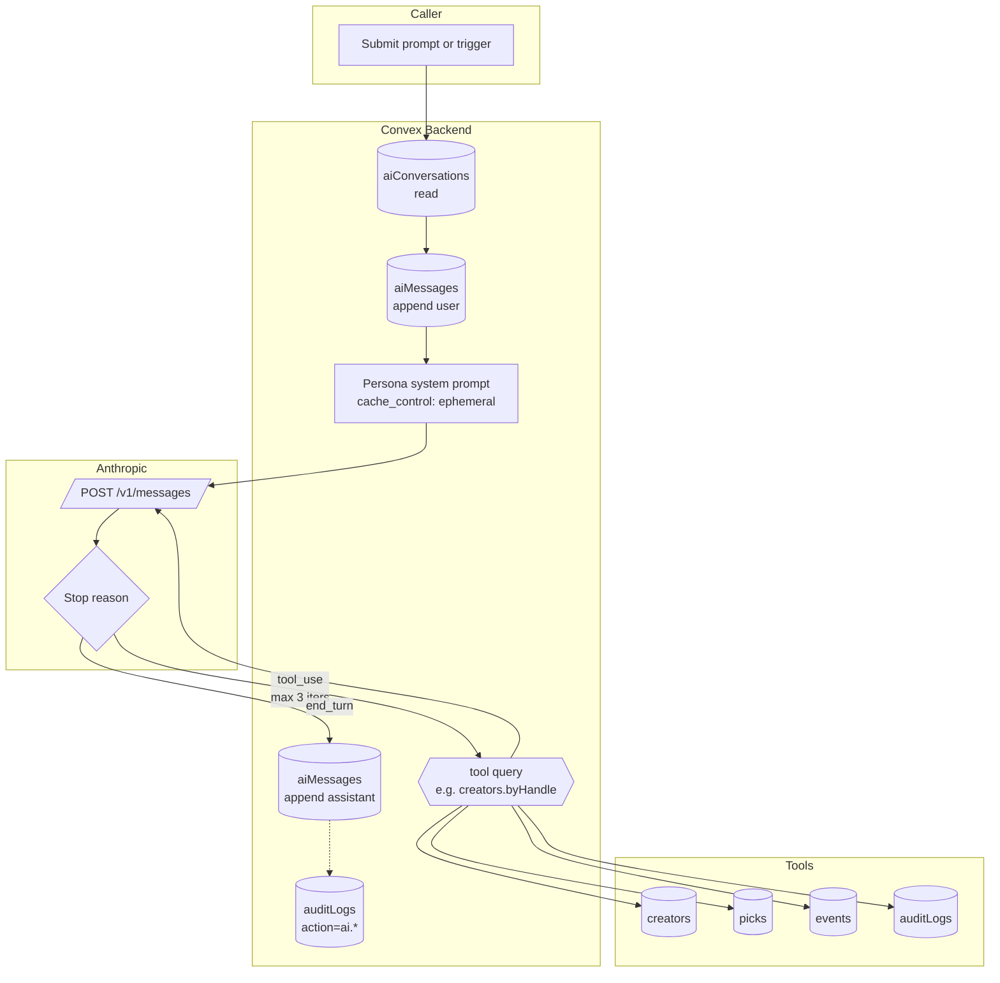

# BPMN-014 — AI intelligence pipeline

## Purpose

Orchestrates every AI call in the system: pick co-write, grading
explanation, Discord summary, recommendations, and the multi-turn
Copilot. Centralizes prompt-cached system prompts, tool-use loops, and
citation harvesting.

## Trigger

- Customer or creator sends a message in `Copilot` (`copilot.respond`).
- Creator clicks **AI co-write** in `/dashboard/create` (`ai.cowrite`).
- Discord inbound cron summarizes new messages (`discord.inbound.importEnabledChannels`).
- Pick grading optionally calls `ai.gradingExplanation` (BPMN-013).

## Preconditions

- `ANTHROPIC_API_KEY` env var configured. When missing, every AI action
  is a quiet no-op and returns `{ skipped: 'no_api_key' }`.
- Caller's role-based prompt is selected (customer vs creator persona).

## Actors / Swimlanes

- **Caller** — UI (Copilot, co-write button) or backend trigger.
- **Convex Backend** — `aiConversations`, `aiMessages`, tool queries,
  `auditLogs`.
- **Anthropic API** — Claude Haiku 4.5 with prompt cache.
- **Tools** — Convex queries exposed as Claude tools (creators, picks,
  events, audit).

## Main flow

## Alternative flows

- **Tool-use cap reached** (3 iterations) → loop terminates, the model
  is told "no more tool calls" and produces a final answer with
  whatever context it has.
- **Tool error** → tool result is the error string; the model can
  recover or apologize. Audit row tags the failed tool name.
- **Citations harvested** → tool results carry `{ kind, id, label }`
  metadata that the orchestrator collects and stores on the assistant
  message for the UI.
- **Stream timeout** → caller sees a friendly error; the partial
  conversation row stays so the user can re-prompt.
- **Persona mismatch** — a customer cannot invoke creator-only tools
  (e.g., their own audit query); the tool function returns
  `UNAUTHORIZED` and the model adapts.

## Postconditions

- `aiMessages` rows for `user`, `tool`, and `assistant` turns.
- Citations stored on the assistant turn.
- `auditLogs` row per AI call with model + token counts.

## Realtime events

- `copilot.messages` query auto-updates as the orchestrator appends
  rows; the UI streams via the `streaming` flag on the assistant
  bubble.

## AI interactions

This **is** the AI surface — every other workflow that needs Claude
delegates to one of:

- `ai.cowrite` (BPMN-007)
- `ai.gradingExplanation` (BPMN-013)
- `discord.inbound.summarize` (Discord pipeline)
- `copilot.respond` (this diagram, multi-turn)

## Module mapping

- [M14 — Recommendations](../modules/M14-recommendations.md)
- [M24 — AI Copilot](../modules/M24-ai-copilot.md)
- [M22 — Audit log](../modules/M22-audit-log.md)
