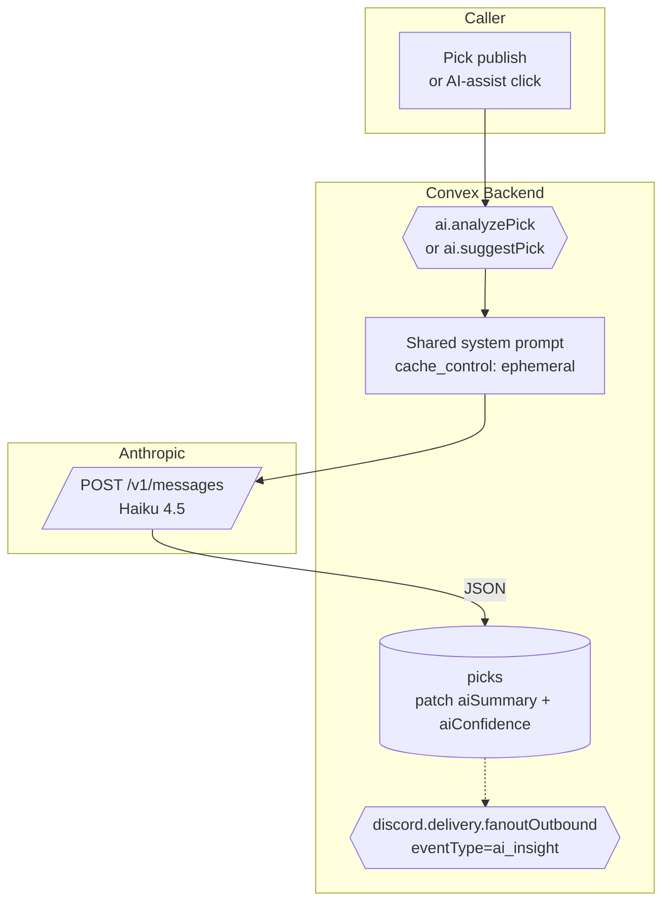
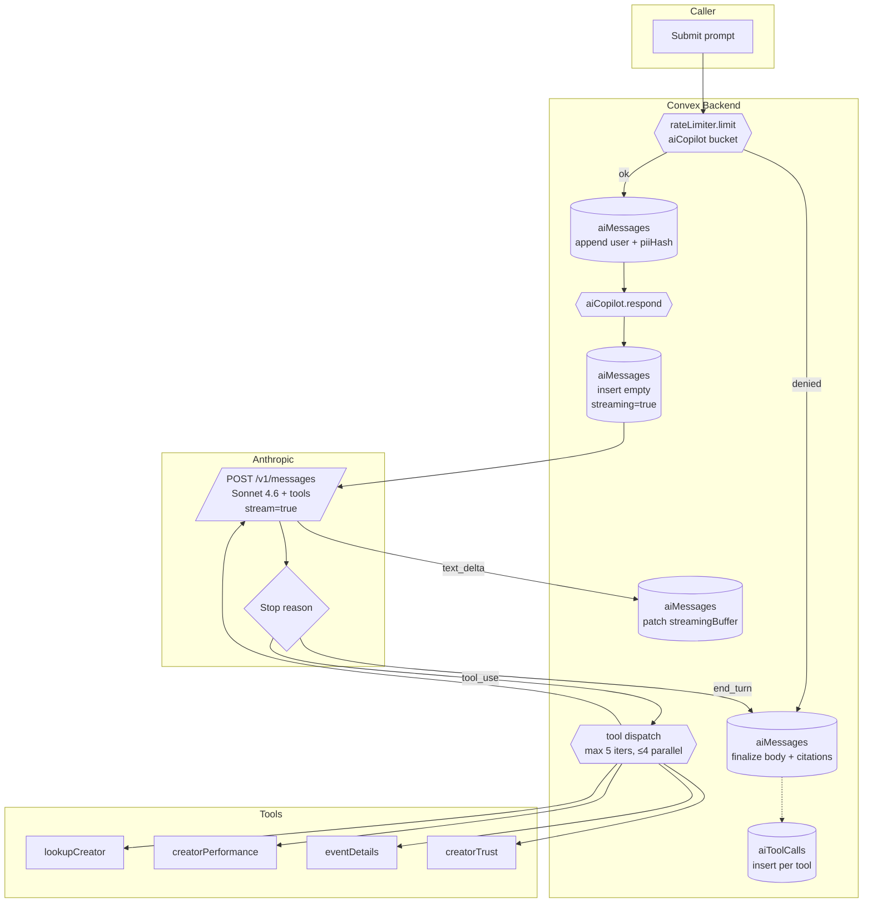

# BPMN-014 — AI intelligence pipeline

## Purpose

Two distinct AI surfaces share this pipeline: **single-shot** analysis
(`ai.suggestPick`, `ai.analyzePick`) and the **multi-turn copilot**
(`aiCopilot.respond`). Both rely on the same Anthropic backend, but use
different models (Haiku 4.5 vs Sonnet 4.6), different rate-limit
buckets, and different storage shapes. This diagram covers both.

## Trigger

**Single-shot path**

- Creator clicks **AI co-write** in `/dashboard/create` (`ai.suggestPick`).
- `picks.publish` schedules `ai.analyzePick` async after insert.
- Discord inbound cron summarizes channel activity
  (`discord.sentiment.recomputeRecent`, `discord.inbound.importEnabledChannels`).

**Multi-turn copilot path**

- Customer sends a message in `/account/copilot` (`aiCopilot.respond`).
- Creator sends a message in `/dashboard/copilot` (same action,
  `persona='creator'`).

## Preconditions

- `ANTHROPIC_API_KEY` env var configured. When missing, every AI action
  is a quiet no-op (single-shot returns `{ skipped: true }`; copilot
  surfaces a friendly error to the user).
- For copilot: caller has token in the `aiCopilot` rate-limit bucket
  (20/HOUR, capacity 6, 4 shards). Denied turns land as an assistant
  message with `stopReason='rate_limited'` so the user sees the cap.
- For copilot: user message passes `scrub()` — emails and 13–19-digit
  PAN runs are redacted, original is sha-256 hashed and the first 16
  hex chars persisted as `aiMessages.piiHash`.

## Actors / Swimlanes

- **Caller** — Copilot UI, AI-assist button, or scheduler.
- **Convex Backend** — `aiConversations`, `aiMessages` (incl.
  `streamingBuffer` for live text deltas), `aiToolCalls`, single-shot
  fields on `picks` (`aiSummary`, `aiConfidence`, `aiReasoning`,
  `aiAnalyzedAt`, `aiModel`).
- **Anthropic API** — Claude Haiku 4.5 (single-shot) and Claude Sonnet
  4.6 (copilot tool-use loop). Both system prompts use
  `cache_control: ephemeral` so the cache is shared across calls.
- **Tools (copilot only)** — internal Convex queries exposed as Claude
  tools: `lookupCreator(handle)` → `creators.getByHandle`,
  `creatorPerformance(creatorId, windowDays)` → derived from
  `picks.byCreator`, `eventDetails(eventId)` →
  `aiCopilot.queries._eventDetails`, `creatorTrust(creatorId)` →
  `trust.get`.
- **Discord (downstream)** — `analyzePick` schedules
  `discord.delivery.fanoutOutbound` with `eventType='ai_insight'` for
  creators with the `aiInsight` alert rule on (BPMN-007).

## Main flow — single-shot

## Main flow — multi-turn copilot

## Alternative flows

- **Rate-limit denied** (copilot) → no Anthropic call; the action writes
  an assistant turn directly via `_appendAssistantTurn` with
  `stopReason='rate_limited'` and a friendly body. Surfaces in the same
  conversation thread so the user sees the cap.
- **Tool-use cap reached** (5 iterations) → loop terminates and a
  fallback assistant turn is finalized with
  `stopReason='max_iters'` and "narrow your question" copy.
- **Tool error** → caught per-tool, returned as
  `{ is_error: true, content: <message> }` to the model; the loop
  continues. Failure recorded on the `aiToolCalls` row.
- **Citations harvested** → assistant text contains inline
  `[tool=name, sampleSize=N, asOf=ISO]` markers + a trailing fenced
  `citations` JSON block; the orchestrator parses both into the
  structured `aiMessages.citations` array.
- **Stream interrupted / Anthropic 5xx** → action retries up to 2x via
  `withRetry`. On final failure, finalizes the streaming row with a
  fallback body and `stopReason='error'`.
- **Persona mismatch (DEFERRED infrastructure)** — there are no
  creator-only tools today, so persona mismatch is not currently
  reachable. When creator-only tools are added, the wiring will return
  `UNAUTHORIZED` through the existing `tool_result` `is_error: true`
  channel; the orchestrator already records the failure on the
  `aiToolCalls` row and lets the model adapt mid-loop.
- **Single-shot, missing Anthropic key** → `analyzePick`,
  `suggestPick`, and `gradingExplanation` all degrade gracefully
  (return `{ skipped: true }` — no throw) so the publish / grading
  chains aren't blocked.

## Postconditions

**Single-shot**

- `picks.aiSummary` / `aiConfidence` / `aiReasoning` populated.
- A scheduled `discord.delivery.fanoutOutbound` (`ai_insight`) for each
  creator opted in.

**Multi-turn**

- `aiConversations` row updated (`messageCount`, `lastMessageAt`).
- `aiMessages` rows for the `user` turn (with `piiHash` if scrubbed)
  and the `assistant` turn (with `streaming` flipped false, full
  `body`, structured `citations`, `model`, `stopReason`,
  token counts incl. `cacheReadTokens`).
- One `aiToolCalls` row per tool invocation for admin observability
  (`ToolCallTrace`).
- 90-day archive cron flips `archivedAt` on idle conversations;
  30-day cron hard-deletes `aiToolCalls` rows.

## Realtime events

- `aiCopilot.queries.messages` (paginated) auto-updates as the
  orchestrator inserts the user turn, the empty streaming row, then
  patches `streamingBuffer` on each text delta. The UI binds via
  `usePaginatedQuery` and re-renders on every patch — no SSE plumbing.
- `aiCopilot.queries.listConversations` updates the sidebar when a new
  conversation is created or archived.

## AI interactions

This **is** the AI surface. Every other workflow that needs Claude
delegates to one of:

- `ai.suggestPick` (BPMN-007 — pre-publish, Haiku 4.5)
- `ai.analyzePick` (BPMN-007 — post-publish async, Haiku 4.5)
- `discord.sentiment.recomputeRecent` (Discord inbound, Haiku 4.5)
- `aiCopilot.respond.respond` (this diagram, multi-turn, Sonnet 4.6,
  tool-use loop, streaming)

## Module mapping

- [M12 — AI intelligence engine](../modules/M12-ai-intelligence-engine.md)
- [M24 — AI Copilot](../modules/M24-ai-copilot-conversational.md)
- [M20 — Discord integration](../modules/M20-discord-integration.md)
- [M25 — Audit & compliance](../modules/M25-platform-settings-compliance-audit.md)
