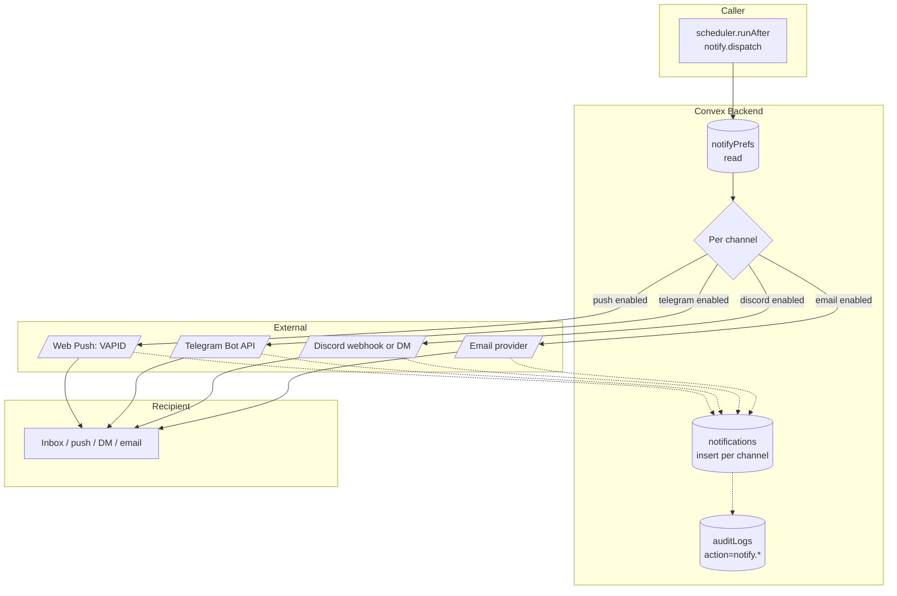

# BPMN-015 — Notification orchestration

## Purpose

Single fanout pipeline for every user-visible event: pick published,
pick graded, line movement, subscription change, dispute resolution,
admin moderation outcome. One contract, four channels, idempotent
retries.

## Trigger

Any internal mutation that schedules `notify.dispatch` (or its narrower
helpers `notify.onPickPublished`, `notify.onPickGraded`,
`notify.onLineMovement`, etc.).

## Preconditions

- Recipient has a `users` row with at least one channel preference
  enabled (or default channels apply).
- Channel-specific env vars exist for the channels being used
  (e.g., `WEB_PUSH_VAPID_*`, `TELEGRAM_BOT_TOKEN`, `RESEND_API_KEY`,
  `DISCORD_BOT_TOKEN`).

## Actors / Swimlanes

- **Caller** — internal mutation that scheduled the fanout.
- **Convex Backend** — `notifyPrefs`, `pushSubscriptions`,
  `discordIntegrations`, `notifications`, `auditLogs`.
- **External services** — Web Push (VAPID), Telegram Bot API,
  Discord API, email provider.
- **Recipient** — sees the inbox entry / push / DM.

## Main flow

## Alternative flows

- **Channel disabled** → that branch is skipped; the rest still fire.
- **External 4xx (e.g., expired Web Push subscription)** → row is
  deleted from `pushSubscriptions`; metric counter increments. No
  retry — the subscription is dead.
- **External 5xx / network** → exponential backoff with cap; after the
  cap, a `notify.failed` audit row is written and a Sentry breadcrumb
  fires.
- **Quiet hours** — if the recipient set quiet hours, push + telegram
  are deferred to the next allowed window; email + in-app inbox still
  fire immediately.
- **Per-channel rate limit** — sharded buckets prevent one creator's
  fanout from starving another's (channel posts, dms, etc.).

## Postconditions

- One `notifications` row per channel × recipient.
- One `auditLogs` row per dispatch.
- External provider tokens may be cleaned up (dead subscriptions).

## Realtime events

- Recipient's `notifications.inbox` query updates without refresh.
- Web Push triggers a service-worker `notification` event in the
  client.

## AI interactions

None on the dispatch path. AI summaries (e.g., "what just happened?")
are produced upstream and passed in the payload.

## Module mapping

- [M19 — Notifications & realtime](../modules/M19-notifications-realtime.md)
- [M22 — Audit log](../modules/M22-audit-log.md)
- [M25 — Discord integration](../modules/M25-discord.md)
