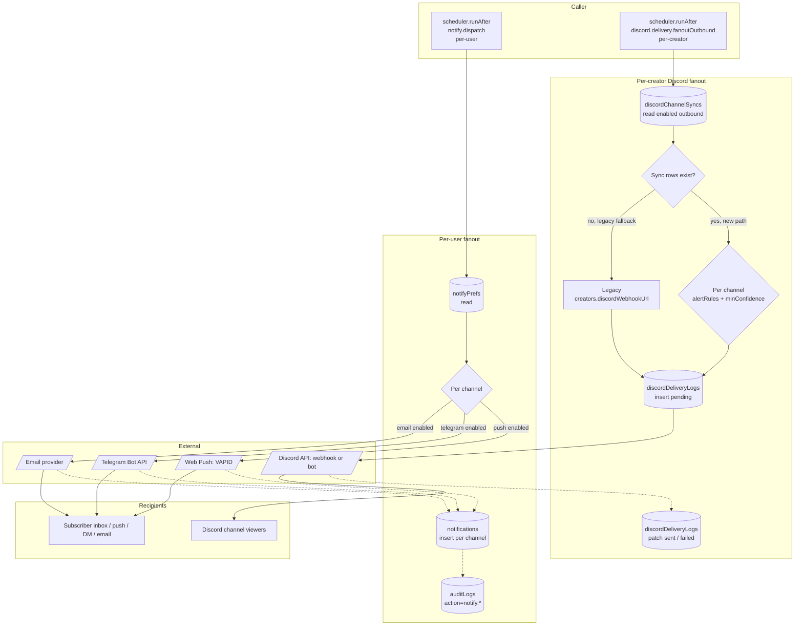

# BPMN-015 — Notification orchestration

## Purpose

Two parallel fanout pipelines, both orchestrated from internal
mutations:

1. **Per-user `notify.dispatch`** — push, telegram, email, in-app
   inbox. Keyed by recipient. Used for every event a _subscriber_ cares
   about: pick published, pick graded, line movement, subscription
   change, dispute resolution, moderation outcome.
2. **Per-creator `discord.delivery.fanoutOutbound`** — Discord embeds
   posted to the creator's mapped guild channels. Keyed by _creator_
   (one creator → many subscribers in their Discord). Used for every
   event the creator's _audience_ cares about. Six event types today:
   `new_pick`, `pick_graded`, `odds_movement`, `creator_live`,
   `ai_insight`, `announcement`.

The two pipelines run in parallel — a published pick triggers BOTH a
per-user `notify.dispatch` and a per-creator `fanoutOutbound`. Discord
is **not** a per-user channel anymore; the legacy `discord` branch in
the per-user fanout has been retired.

## Trigger

**Per-user**: any internal mutation that schedules `notify.dispatch`
(or its narrower helpers `notify.onPickPublished`,
`notify.onPickGraded`, `notify.onLineMovement`, etc.).

**Per-creator**: any internal mutation that schedules
`internal.discord.delivery.fanoutOutbound`. Today: `picks.publish`
(`new_pick`), `picks.grade` (`pick_graded`),
`lineMovement.pollLineMovements` (`odds_movement`), `streams.pollStreams`
on offline→live transition (`creator_live`), and `ai.analyzePick` on
completion (`ai_insight`).

**Lifecycle kinds (per-user, transactional)**: `welcome`,
`subscription_active`, `subscription_past_due`,
`subscription_cancelled`. These are scheduled by lifecycle helpers
(`internal.notify.onUserSignup`, `onSubscriptionActive`,
`onSubscriptionPastDue`, `onSubscriptionCancelled`) and **bypass
per-kind `notifyPrefs` toggles** because they're transactional, not
opt-in. Channel-level disabling (e.g., user has email off entirely)
still applies. The dedup window is `NOTIFY_DEDUP_WINDOW_MS`-overridable.

## Preconditions

**Per-user fanout**

- Recipient has a `users` row with at least one channel preference
  enabled (or default channels apply).
- Channel env vars present (`WEB_PUSH_VAPID_*`, `TELEGRAM_BOT_TOKEN`,
  `RESEND_API_KEY`).

**Per-creator Discord fanout**

- Either: at least one enabled outbound `discordChannelSyncs` row
  exists for the creator (new path), OR
- Legacy: `creators.discordWebhookUrl` is set (legacy single-webhook
  path, used as a fallback when no syncs exist).
- The relevant `alertRules.<eventType>` flag is on the sync row
  (defaults to all-on when the object is absent).
- For premium-confidence-gating: pick's confidence ≥
  `alertRules.minConfidence` (when set).

## Actors / Swimlanes

- **Caller** — internal mutation that scheduled the fanout.
- **Convex Backend** — `notifyPrefs`, `pushSubscriptions`,
  `discordIntegrations`, `discordChannelSyncs`, `discordDeliveryLogs`,
  `notifications`, `auditLogs`.
- **External services** — Web Push (VAPID), Telegram Bot API, Discord
  API (webhooks + bot), email provider.
- **Recipient (per-user)** — subscriber's inbox / push / DM / email.
- **Discord guild (per-creator)** — many viewers; one delivery posts to
  one channel and is seen by everyone in it.

## Main flow

## Alternative flows

- **Channel disabled** → that branch is skipped; the rest still fire.
- **External 4xx (e.g., expired Web Push subscription)** → row is
  deleted from `pushSubscriptions`; metric counter increments. No
  retry — the subscription is dead.
- **External 5xx / network** → exponential backoff with cap; after the
  cap, a `notify.failed` audit row is written and a Sentry breadcrumb
  fires.
- **Quiet hours (DEFERRED)** — recipient-side quiet-hour deferral is
  reserved for a future iteration; today every channel fires
  immediately when its toggle is on.
- **Per-channel rate limit** — sharded buckets prevent one creator's
  fanout from starving another's. `channelsPost` is sharded across 8
  shards; other inbound/outbound paths use their own shard counts.
- **Discord 429 / 5xx** → `discord.delivery.retryQueue` cron (every
  10 min) re-fires `failed` rows with `attemptCount ≤ 3`, honoring
  Discord's `Retry-After` header. After 3 attempts the row stays
  `failed` and surfaces in `DiscordDeliveryLogTable`.
- **Outbound is fire-and-forget** — Discord errors never throw back
  into the publish/grade chain. The publish mutation completes even if
  Discord is down; failure is recorded in `discordDeliveryLogs` and
  audit-logged.
- **Copilot rate-limit refusal is NOT a notification.** When
  `aiCopilot.respond` is denied by the `aiCopilot` rate-limit bucket,
  the action writes an in-conversation assistant turn (via
  `_appendAssistantTurn`, `stopReason='rate_limited'`). It does not
  schedule `notify.dispatch` — the user sees the cap inside the chat,
  not as a push/email.

## Postconditions

**Per-user**

- One `notifications` row per channel × recipient.
- One `auditLogs` row per dispatch.
- External provider tokens may be cleaned up (dead subscriptions).

**Per-creator Discord**

- One `discordDeliveryLogs` row per channel × event (status starts
  `pending`, transitions to `sent` or `failed`).
- On the legacy fallback path, the row carries the masked webhook URL
  (last 6 chars only) instead of an `integrationId`.
- One audit row mirroring the delivery for cross-system traceability.

## Realtime events

- Recipient's `notifications.inbox` query updates without refresh.
- Web Push triggers a service-worker `notification` event in the
  client.

## AI interactions

None on the dispatch path. AI summaries (e.g., "what just happened?")
are produced upstream and passed in the payload.

## Module mapping

- [M13 — Notifications & smart alerts](../modules/M13-notifications-smart-alerts.md)
- [M20 — Discord integration](../modules/M20-discord-integration.md)
- [M21 — Telegram integration](../modules/M21-telegram-integration.md)
- [M25 — Platform settings, compliance & audit](../modules/M25-platform-settings-compliance-audit.md)
