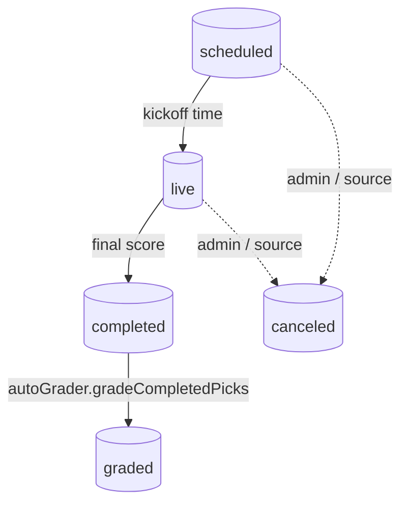
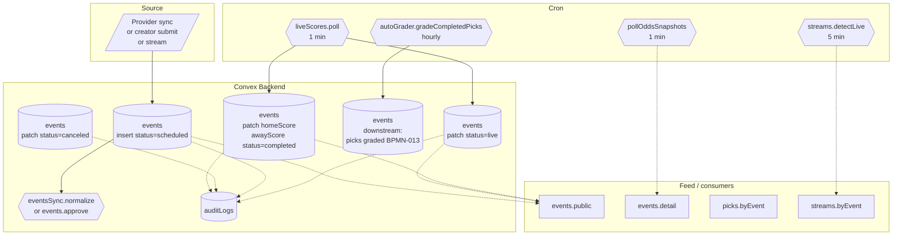

# BPMN-016 — Realtime event lifecycle

## Purpose

The architectural backbone. An event — federated provider event,
creator-submitted custom event, or stream-linked event — lives through a
single, shared state machine. Picks, streams, channels, grading, and
notifications all attach to this lifecycle.

## Trigger

- Provider ingest (`eventsSync.fetchAndUpsert`) for federated events.
- `events.create` mutation for creator-submitted events
  (BPMN-009).
- `streams.create` for stream-only events (BPMN-008 — the stream may
  link to an existing event or create a lightweight one).

## Preconditions

- Sport / league reference data exists.
- For verified events: an admin or upstream source has approved them
  (`verificationStatus='verified'`).

## Actors / Swimlanes

- **Source** — external provider, creator, or stream.
- **Convex Backend** — `events`, `picks`, `streams`, `channels`,
  `auditLogs`.
- **Cron** — odds (BPMN-012), live scores, grading (BPMN-013), stream
  detection (BPMN-008).
- **Feed / consumers** — public events list, picks, streams.

## State machine

## Main flow

## Alternative flows

- **Postponement** — `events.postpone(eventId, newStartsAt, newTime?,
notes?)` admin mutation flips the event back to `upcoming` with the
  new start time. MFA-gated (`gateOnMfaIfEnrolled`), audit-logged with
  `event.postponed` carrying both the previous and new `startsAt`.
  Pre-existing picks stay attached and pending; subscribers see the
  rescheduled time live via the existing `events.*` queries. Rejects
  postponement on `completed` or `cancelled` events and on
  `newStartsAt` in the past.
- **Forfeit / no-contest (DEFERRED)** — there is no automated forfeit
  state machine; manual remediation routes through admin moderation
  (BPMN-010) + dispute-driven grade override (BPMN-011). Forfeit-aware
  void grading is reserved for a future iteration.
- **Late-data dedup (DEFERRED)** — there is no automated dedup of
  near-identical events that arrive after the federated row was
  imported. Today, conflicts are caught by the duplicate guard on
  `events.create` (BPMN-009) and otherwise resolved manually.
- **Score correction post-grading** → grades are immutable
  (NFR-006); the correction flows through dispute resolution
  (BPMN-011) and writes a `pick.grade.overridden` audit row.
- **Stream-only event with no provider counterpart** → the event is
  created in the `verified` state by the stream creator (admin
  approval still applies if it's a custom event — BPMN-009).
- **Provider drift** — an event already in `live` whose provider record
  disappears keeps the last-known state; a metric counter ticks so
  admins can investigate.

## Postconditions

- `events.status` reflects ground truth: `scheduled`, `live`,
  `completed`, `graded`, or `canceled`.
- All attached `picks` are graded once the event is `graded`.
- `streams` and `channels` rows are archived once the event ends.
- Audit rows for every transition (append-only).

## Realtime events

- Every `events.public`, `events.detail`, `picks.byEvent`,
  `streams.byEvent`, and `feed.list` query subscribes to events.

## AI interactions

- Optional dedupe pass on `eventsSync.normalize` to merge
  near-identical creator submissions with federated events.
- Optional `ai.gradingExplanation` on the
  `completed → graded` transition (BPMN-013).

## Module mapping

- [M04 — Provider-agnostic event engine](../modules/M04-provider-agnostic-event-engine.md)
- [M05 — Picks publishing engine](../modules/M05-picks-publishing-engine.md)
- [M09 — Pick grading & performance](../modules/M09-pick-grading-performance.md)
- [M11 — Realtime odds intelligence](../modules/M11-realtime-odds-intelligence.md)
- [M15 — Livestream integrations](../modules/M15-livestream-integrations.md)
- [M22 — External sports data providers](../modules/M22-external-sports-data-providers.md)
- [M23 — Custom event review & federation](../modules/M23-custom-event-review-federation.md)
- [M25 — Platform settings, compliance & audit](../modules/M25-platform-settings-compliance-audit.md)
